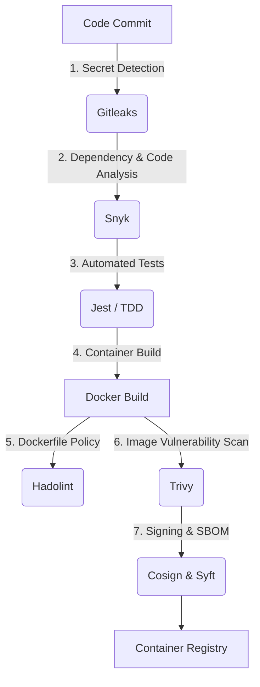
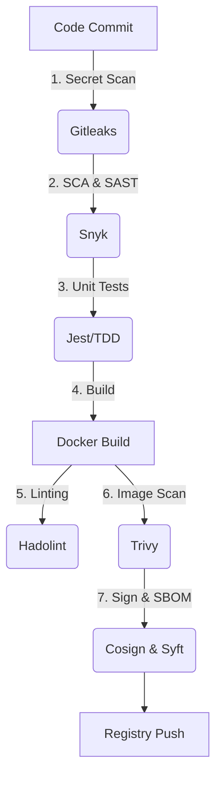

# Governed Software Delivery Pipeline (Full-Stack Reference Implementation)

> A Secure Software Supply Chain Reference Implementation


](https://snyk.io/)
](https://owasp.org/)

](https://docker.com)
](https://opensource.org/licenses/Apache-2.0)

## TL;DR

This repository demonstrates how to design and operate a governed CI/CD pipeline where:
- Quality and security gates are enforced automatically
- Container artifacts are signed, traceable, and auditable
- Vulnerabilities are managed through explicit risk policies, not binary pass/fail rules
- The CI/CD pipeline acts as the primary control plane for software delivery

The application is intentionally simple — the focus is on **software delivery architecture, DevOps practices, and engineering governance**, not framework complexity.


## Project Overview 🛡️

This repository demonstrates the **design and operation of a governed software delivery pipeline**, focusing on **DevOps engineering principles, risk management, and supply chain integrity**.

Rather than emphasizing a specific programming language or framework, the project treats the application as a delivery vehicle used to showcase:
- Policy-driven CI/CD pipelines
- Built-in quality and security gates
- Artifact traceability and verification
- Controlled risk acceptance in a real-world scenario

The result is a **production-oriented reference implementation** of how modern teams can enforce engineering standards across the entire Software Development Lifecycle (SDLC).

## Engineering Goals

The pipeline and architecture were designed around the following outcomes:

### 1. Reproducible and Verifiable Builds

Every build produces traceable artifacts that can be:
- Scanned
- Signed
- Verified post-build

### 2. Early Risk Detection (Shift Left)

Quality and security checks are executed before artifact creation, reducing downstream risk and cost.

### 3. Policy Enforcement Through Automation

Engineering standards are enforced by the pipeline itself, not by manual review.

### 4. Explicit Risk Management

Not all findings are treated equally — risks are prioritized, remediated, or formally accepted with documentation.
---

## Delivery Architecture (CI/CD as a Control Plane)

GitHub Actions is used as the delivery control plane to orchestrate validation, testing, scanning, and artifact governance.



This pipeline is intentionally **fail-fast**: artifacts are never built or published unless all required quality gates pass.

### Tooling Strategy

| Stage | Tool | Purpose |
| :--- | :---: | :---: |
| 1. Secret Scanning | Gitleaks | Prevents hardcoded  credentials/secrets from entering the repo. |
| 2. SCA & SAST | Snyk | Scans dependencies and code logic for known vulnerabilities. |
| 3. Testing (TDD) | Jest + Supertest | Validates application logic and API endpoints before build. |
| 4. Docker Linting | Hadolint | Enforces best practices in Dockerfile construction. |
| 5. Container Scan | Trivy | Scans the built Docker image for OS-level vulnerabilities. |
| 6. Image Signing | Cosign | Cryptographically signs the image to guarantee integrity (SLSA). |
| 7. SBOM Generation | Syft | Generates a Software Bill of Materials (SPDX) for transparency. |

> Tool choice is intentional but interchangeable — the architecture and controls matter more than the vendor.

## Case Study: Legacy Risk Remediation 🔬

To validate the effectiveness of the delivery control plane, a legacy application with known security debt was intentionally passed through the pipeline.

### 1. The Problem (Initial Assessment)

A baseline scan revealed significant technical and security debt across transitive dependencies.

**Common Vulnerabilities Detected:**

* **Cross-Site Scripting (XSS):** Detected in older frontend libraries.
* **Prototype Pollution:** Found in backend utility packages.
* **Arbitrary Code Execution:** Critical flaw in a deep dependency.

### 2. The Solution (Remediation Process)

I adopted a systematic approach to fix these issues:

1. **Direct Upgrades:** Prioritized direct upgrades where safe versions were available.
2. **Patches:** Applied patches when upgrades were not feasible without breaking changes.
3. **Defensive Coding:** Refactored backend logic to validate input and sanitize headers (OWASP Top 10).

### 3. The Result (Final Status)

After applying the fixes and re-running the CI/CD pipeline checks:

Remediation Workflow

Baseline:
Initial scans detected 27 Critical vulnerabilities

Triage:

Dependency upgrades automated via Snyk

Manual refactoring to mitigate XSS and Prototype Pollution

Risk Acceptance Policy:

Zero Tolerance: Critical / High vulnerabilities block the pipeline

Accepted Risk: Medium / Low vulnerabilities may proceed if no patch exists, prioritizing delivery velocity

| Severity | Initial Count | Current Count | Status |
| :--- | :---: | :---: | :--- |
| **Critical** | 27 | 0 | ✅ Fixed |
| **High** | 116 | 0 | ✅ Fixed |
| **Medium** | 191 | 2 | ⚠️ Accepted Risk (Documented) |
| **Low** | 345 | 22 | ℹ️ Backlog |

> This demonstrates risk-based decision making, not absolute zero-tolerance — a more realistic production posture.

#### Evidence

| Initial Vulnerability Scan | Post-Fix Clean Scan |
| --- | --- |
|  |  |

## Local Development & Testing

### Prerequisites

* **Node.js v18+**
* **Docker**

### Setup

```bash
git clone https://github.com/agslima/.git
cd folder
npm install
```

### 2. Running Tests (TDD)

```bash
# Run unit and integration tests
npm test

# Run tests in watch mode (for development)
npm run test:watch
```

To verify the current security status of the application, follow these steps:

### 3. Security Validation (Optional)

You need a Snyk account and CLI installed.

Download a standalone executable (for macOS, Linux, and Windows) of the Snyk CLI for your platform.

```bash
snyk auth
snyk test
```

### 4. Running the App

```bash
npm start
```

---

## Policy, Governance & Verification

* **Security by Design:** Controls embedded early in the SDLC
* **Artifact Verification:** Container images can be verified using the public Cosign key in this repository
* **Responsible Disclosure:** See SECURITY.md

## Technology Stack (Reference)

* **Frontend:** React
* **Backend:** Node.js / Express
* **CI/CD:** GitHub Actions
* **Containers:** Docker
* **Supply Chain:** Cosign, Syft
* **Security Analysis:** [Snyk](https://snyk.io) (Software Composition Analysis & SAST), Trivy, Gitleaks

> The application stack is intentionally simple — the focus is on delivery architecture, not framework complexity.

---

## License

This project is licensed under the Apache 2 License. See the `LICENSE file for details.

## Final Note

> This repository should be read as a software delivery system, not an application demo.
> The application exists to validate the policies, controls, and engineering decisions enforced by the pipeline.
