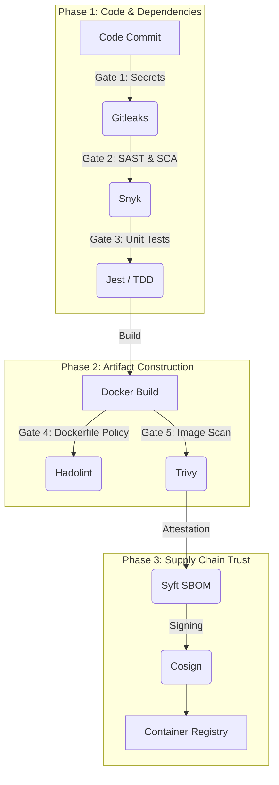

# Governed Software Delivery Pipeline (Full-Stack Reference Implementation)


[](https://docker.com)
[](https://opensource.org/licenses/Apache-2.0)

### A Secure Software Supply Chain & DevOps Reference Implementation

> Mission: Design and implement a secure software delivery pipeline that balances strong security guarantees with development velocity, using CI/CD as the primary governance control plane.

## TL;DR

This repository demonstrates how to design and operate a governed CI/CD pipeline where:

- Quality and security gates are enforced automatically
- Container artifacts are **signed, traceable, and SLSA Level 3–compliant**
- Vulnerabilities are managed through explicit **risk policies**, not binary pass/fail rules
- The pipeline extends beyond build to include **Runtime Verification (DAST)** and **GitOps-based Admission Control**

> The application is intentionally simple. The focus is on **software delivery architecture, DevOps practices, and engineering governance**, not framework complexity.

## Project Overview 🛡️

This project demonstrates the design and operation of a governed software delivery pipeline, focusing on:

- DevOps and Platform Engineering principles
- Risk-based security management
- Secure software supply-chain practices

Rather than emphasizing a specific programming language or framework, the application serves as a delivery vehicle to showcase:

- Policy-driven CI/CD (GitHub Actions as the control plane)
- Defense in Depth across build, artifact, and runtime phases
- Zero Trust supply-chain controls using keyless signing
- Managed security debt in a real-world delivery scenario

The result is a **production-oriented reference implementation** of how modern teams enforce engineering standards across the SDLC.

## Engineering Goals

The architecture was designed to satisfy three core **non-functional requirements**:

### 1. Reliability

- Builds must be deterministic
- If code, tests, or policies fail, **no artifact is created**

### 2. Traceability

Every container image is:

- Cryptographically signed using Sigstore/Cosign
- Attested with build provenance verifying the builder identity
- Linked to a specific Git commit and SBOM

### 3. Risk Management

Security is not binary. The system differentiates between:

- **Blockers:** Critical / High vulnerabilities → pipeline fails
- **Managed Debt:** Medium / Low vulnerabilities tracked in `docs/security-debt.md`

---

## Delivery Architecture (CI/CD as a Control Plane)

### CI/CD as a Control Plane

GitHub Actions is used as the delivery control plane, following a **Pipeline-as-Code** model.

#### Design Decision

GitHub Actions was chosen over traditional CI servers (e.g., Jenkins) to:

- Minimize operational overhead
- Keep pipeline logic versioned alongside the application
- Treat CI/CD as part of the codebase, not external infrastructure

### Governance Pipeline



```mermaid

graph TD
    subgraph "Phase 1: Code & Dependencies"
        A[Code Commit] -->|Gate 1: Secrets| B(Gitleaks)
        B -->|Gate 2: SAST & SCA| C(Snyk)
        C -->|Gate 3: Unit Tests| D(Jest / TDD)
    end
    
    subgraph "Phase 2: Artifact Construction"
        D -->|Build (Ephemeral)| E[Docker Build]
        E -->|Gate 4: Dockerfile Policy| F(Hadolint)
        F -->|Gate 5: DAST (Runtime)| G(OWASP ZAP)
    end
    
    subgraph "Phase 3: Release & Trust"
        G -->|Build & Push| H[Container Registry]
        H -->|Gate 6: Image Scan| I(Trivy)
        I -->|Attestation| J(Syft SBOM)
        J -->|Signing & Provenance| K(Cosign / SLSA)
    end

    subgraph "Phase 4: Delivery (GitOps)"
        K -->|Policy Check| L(Kyverno CLI)
        L -->|Update Manifest| M[k8s/deployment.yaml]
        M -->|Git Commit & Push| N[Main Branch]
    end
```

> This pipeline is intentionally **fail-fast**: artifacts are never built or published unless all required quality gates pass.

---

## Quality & Risk Controls

### Layer 1: Application Security (Pre-Build)

- **Gitleaks:** Prevents hardcoded credentials
- **Snyk (SAST/SCA):** Analyzes source code and dependency trees

### Layer 2: Artifact Security (Post-Build)

- **Trivy:** Detects OS-level vulnerabilities in the final image
- **Hadolint:** Enforces Dockerfile best practices (non-root users, pinned versions)

### Layer 3: Runtime Analysis (DAST)

- **OWASP ZAP**
  - Pipeline spins up an ephemeral application instance
  - Actively scans runtime behavior (headers, cookies, misconfigurations)
  - Validates behavior, not just code

### Layer 4: Supply Chain Guarantees (SLSA Level 3)

- **Cosign (Keyless):** OIDC-bound image signing
- **SLSA Provenance:** Verifiable build identity and process
- **Syft:** SPDX-formatted SBOM for transparency and future incident response

---

## Deployment Architecture & Enforcement

### Secret Management (12-Factor App)

- Secrets stored in GitHub Actions Secrets
- Injected as environment variables at runtime

### GitOps & Admission Control

- The pipeline does not deploy directly.
- CI updates Kubernetes manifests with immutable image digests
- Kyverno policies enforce that only images signed by this workflow identity can run

This demonstrates how build trust is enforced at runtime, not just at CI time.

---

## Operational Evidence

### Case Study: Legacy Risk Remediation 🔬

To validate the effectiveness of the delivery control plane, a legacy application with known security debt was intentionally passed through the pipeline.

### Remediation Workflow

- **Baseline:**
  - Initial scans detected 27 Critical vulnerabilities

- **Triage:**
  - Dependency upgrades automated via Snyk
  - Manual refactoring to mitigate XSS and Prototype Pollution

- **Risk Acceptance Policy:**
  - Zero Tolerance: Critical / High vulnerabilities block the pipeline
  - Accepted Risk: Medium / Low vulnerabilities may proceed if no patch exists, prioritizing delivery velocity

### Metrics & Results

| Severity | Initial Count | Current Count | Status |
| :--- | :---: | :---: | :--- |
| **Critical** | 27 | 0 | ✅ Fixed |
| **High** | 116 | 0 | ✅ Fixed |
| **Medium** | 191 | 2 | ✅ Fixed (29/12/2025) |
| **Low** | 345 | 2 | ℹ️ Managed Debt |

> This demonstrates risk-based decision making, not absolute zero-tolerance — a more realistic production posture.
> Managed debt is tracked in `docs/security-debt.md`, demonstrating risk-based decision making

### Evidence

| Initial Vulnerability Scan | Post-Fix Clean Scan |
| --- | --- |
|  |  |

---

## Verification (How to Audit)

### Verify Image Signature

```bash
cosign verify \
  --certificate-identity-regexp "https://github.com/agslima/secure-app-analysis/.*" \
  --certificate-oidc-issuer "https://token.actions.githubusercontent.com" \
  docker.io/agslima/software-delivery-pipeline:latest
  ```

### Verify SLSA Provenance

```bash
gh attestation verify oci://docker.io/agslima/software-delivery-pipeline:latest \
  --owner agslima \
  --repo secure-app-analysis
  ```

## Local Development & Testing

### Prerequisites

- **Node.js v18+**
- **Docker**

```bash
git clone https://github.com/agslima/software-delivery-pipeline.git
cd software-delivery-pipeline
npm install
npm test
npm start
```

---

## Policy, Governance & Verification

- **Security by Design:** Controls embedded early in the SDLC
- **Artifact Verification:** Container images can be verified using the public Cosign key in this repository
- **Responsible Disclosure:** See SECURITY.md

---

## Technology Stack (Reference)

- **Frontend/Backend:** React /Node.js
- **CI/CD:** GitHub Actions
- **Containers:** Docker
- **Supply Chain:** Cosign, Syft, SLSA Generator
- **Security Analysis:** Snyk, Trivy, OWASP ZAP, Gitleaks
- **Governance:** Kyverno

> The application stack is intentionally simple — the focus is on delivery architecture, not framework complexity.
CI/CD: GitHub Actions

---

## License

This project is licensed under the Apache 2 License. See the `LICENSE` file for details.

---

## Final Note

> This repository should be read as a **software delivery system**, not an application demo.
> The application exists to validate the **policies, controls, and engineering decisions** enforced by the pipeline.
