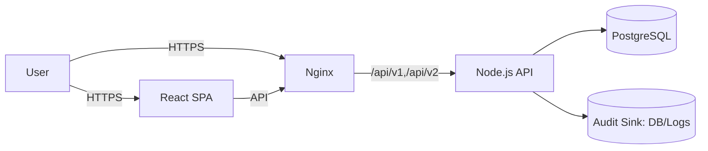

# System Diagram (Phase 3)

```mermaid
graph LR
  User -->|HTTPS| Nginx
  Nginx -->|/api/v1,/api/v2| API[Node.js API]
  API --> DB[(PostgreSQL)]
  API --> Audit[(Audit Sink: DB/Logs)]
  User -->|HTTPS| SPA[React SPA]
  SPA -->|API| Nginx
```

