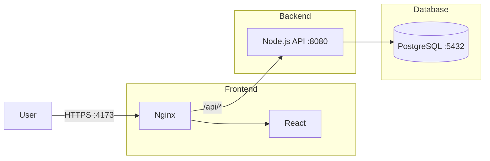

# StayHealthy Prescription Portal

## Internal Engineering Documentation


## 1. Purpose & Scope ​📋

The **StayHealthy Prescription Portal** is an internal full-stack system designed to demonstrate and validate **enterprise-grade application patterns** for digital prescription workflows.

The system provides:

- Read-only access to prescription records
- Secure authentication and authorization
- A web-based user interface for viewing and printing prescriptions
- A RESTful API suitable for integration with downstream systems

> [!NOTE]
> This application is not intended for real clinical use. It serves as a **reference implementation** for architecture, security, and operational patterns.

---

## 2. System Overview 🧩

The platform replaces paper-based prescriptions with a **digitally verifiable representation** accessible through a Single Page Application (SPA) backed by a stateless API.

Primary goals:

- Demonstrate clean separation between presentation, API, and persistence layers
- Enforce authentication and request-level security controls
- Provide a deployable, containerized environment suitable for internal evaluation and iteration

---

## 3. High-Level Architecture 🏗

The system is composed of three primary components:

### 1. Frontend (Client)

- React-based Single Page Application
- Served as static assets via Nginx
- Proxies API requests to the backend

### 2. Backend (Server)

- Stateless Node.js / Express API
- Handles authentication, request validation, and business logic
- Exposes REST endpoints under /api/v1

### 3. Database

- PostgreSQL instance
- Persistent storage for prescription and user data
- Managed via Knex.js migrations



### Demo

| Login page| Main page |
|---|---|
|  |  |

---

## 4. Technology Stack 🛠

### Frontend

- React 18
- Vite
- Nginx (static hosting + reverse proxy)

### Backend

### Node.js (>= 18)

- Express
- Knex.js (SQL query builder & migrations)

### Database

- PostgreSQL 15

### Infrastructure

- Docker
- Docker Compose
- Multi-stage builds

### Quality & Tooling

- ESLint v9
- Prettier
- Jest (unit & integration tests)
- OpenAPI 3.0 (Swagger)

---

## 5. Security Model (Application-Level) 🛡️

The application implements **baseline security controls** appropriate for internal systems and reference architectures.

### Authentication

- Username/password authentication
- Credentials validated server-side
- JWT issued upon successful authentication

### Authorization

- Protected routes enforced via middleware
- Bearer token required for prescription access

### Transport & Headers

- Content Security Policy (CSP) enforced
- Security headers applied at the application layer
- Reverse proxy reduces CORS complexity

### Abuse Protection

- Rate limiting applied to API endpoints
- **Out of Scope:**
  - Role-based access control (RBAC)
  - Token rotation / refresh flows
  - Fine-grained audit logging
  - Compliance certifications

---

## 6. Configuration & Environment 💻

All runtime configuration is environment-driven.

Example `.env` (non-production):

```ini
NODE_ENV=production
PORT=8080
LOG_LEVEL=info

DB_USER=app_user
DB_PASS=****
DB_NAME=prescriptions_db

JWT_SECRET=****
ADMIN_USER=admin
ADMIN_PASS=****
CORS_ORIGIN=http://localhost:4173
```

> Note:
> Demo credentials must be provisioned via local secrets or environment variables.

Additional security-related configuration:
- Secrets can be sourced via environment variables, `*_FILE`, `/run/secrets/*`, or a JSON blob in `SECRETS_JSON`.
- `ENFORCE_TLS=true` rejects non-HTTPS requests when running behind a TLS-terminating proxy.
- Field-level encryption supports key rotation via `DATA_ENCRYPTION_KEY_ID` (primary) and `DATA_ENCRYPTION_KEYS`.
- Audit logging supports `AUDIT_SINK` (`db` or `console`) and `AUDIT_PII_REDACTION` (`none` or `strict`).
- Edge security is enforced at the Nginx layer (basic WAF rules, rate limits, hardened headers).

### Test Database (Docker)

A dedicated test Postgres can be started with:

```bash
app/scripts/test-db-compose.sh up
```

Defaults:
- Host port `5433` (`TEST_DB_PORT` to override)
- Database `prescriptions_test`
- Set `TEST_DB_USER`/`TEST_DB_PASS` for credentials

### Metrics (Prometheus)

Enable metrics with:

```bash
METRICS_ENABLED=true
METRICS_PATH=/metrics
METRICS_AUTH_TOKEN=<set>
```

Then fetch:
```text
GET /metrics (with optional Bearer token)
```

### Compliance Artifacts

Templates and baseline compliance artifacts live in:

- `app/compliance/README.md`

### Backups and Restore

Create a backup (Compose mode by default):

```bash
app/scripts/backup-db.sh
```

Restore (requires explicit confirmation):

```bash
CONFIRM_RESTORE=true app/scripts/restore-db.sh /path/to/backup.dump
```

Encryption:
- Set `BACKUP_ENCRYPTION_KEY` (or `BACKUP_ENCRYPTION_KEY_FILE`) to encrypt backups.
- Set `BACKUP_REQUIRE_ENCRYPTION=true` to fail if no key is provided.

### Deployment Hardening

Build release images with provenance labels, SBOMs, and optional signing:

```bash
BACKEND_IMAGE=registry.example.com/stayhealthy-backend:1.0.0 \
FRONTEND_IMAGE=registry.example.com/stayhealthy-frontend:1.0.0 \
app/scripts/build-release-images.sh
```

Release deploy (digest pinned):
```bash
app/scripts/pin-release-images.sh
docker compose -f app/docker-compose.release.yml --env-file app/.env.release up -d
```

---

## 7. API Documentation 📡

The backend exposes a documented REST API.

- OpenAPI 3.0 specification
- Swagger UI available at:

```text
  /api/v1/api-docs
```

The API contract is intended to be:

- Predictable
- Versioned
- Suitable for internal consumers and automated testing

---

## 8. Deployment Model 🚀

The system is deployed using **Docker Compose**, enabling reproducible local and CI environments.

### Start All Services

```bash
docker-compose up --build
```

### Exposed Services

| Service | Address |
| --- | --- |
| Web UI | http://localhost:4173 |
| API | http://localhost:4173/api/v1 |
| API Docs | http://localhost:4173/api/v1/api-docs |

---

## 9. Database Management 📦

Schema management is handled via **Knex migrations**.

Typical workflows:

```bash
# Apply migrations
npm run db:migrate

# Seed demo data
npm run db:seed
```

Migrations are:

- Version-controlled
- Deterministic
- Executed automatically in containerized environments

---

## 10. Development & Quality Standards ⚙

### Linting

```bash
# Backend
cd server && npm run lint

# Frontend
cd client && npm run lint
```

### Testing

- Jest used for unit and integration tests
- API endpoints validated via Supertest
- Authentication and middleware tested in isolation

---

## 11. Project Structure 📂

```text
app/
├── client/                 # React Frontend
│   ├── src/
│   │   ├── api/            # API Integration
│   │   ├── components/     # UI Components (Login, etc.)
│   │   └── styles/         # Custom CSS
│   └── docker/             # Dockerfile.client
│
├── server/                 # Node.js Backend
│   ├── src/
│   │   ├── config/         # Env, Database, Swagger Config
│   │   ├── db/             # Migrations & Seeds
│   │   ├── docs/           # OpenAPI.yaml
│   │   ├── middlewares/    # Auth, Error Handling, Logger
│   │   ├── modules/        # Feature Modules (Auth, Prescription)
│   │   └── utils/          # Logger, Helpers
│   └── docker/             # Dockerfile.server
│
└── docker-compose.yml      # Orchestration

```

---

## 12. Non-Goals 🚧

This system does not aim to:

- Serve as a certified medical record system
- Handle real patient data
- Provide regulatory compliance guarantees
- Replace enterprise IAM or audit platforms

---

## 13. License ⚖️

Licensed under the Apache 2.0 License. See the `LICENSE` file for details.

---

## Final Note

This repository should be treated as:
> An internal reference implementation showcasing production-oriented patterns, not a clinical product.
