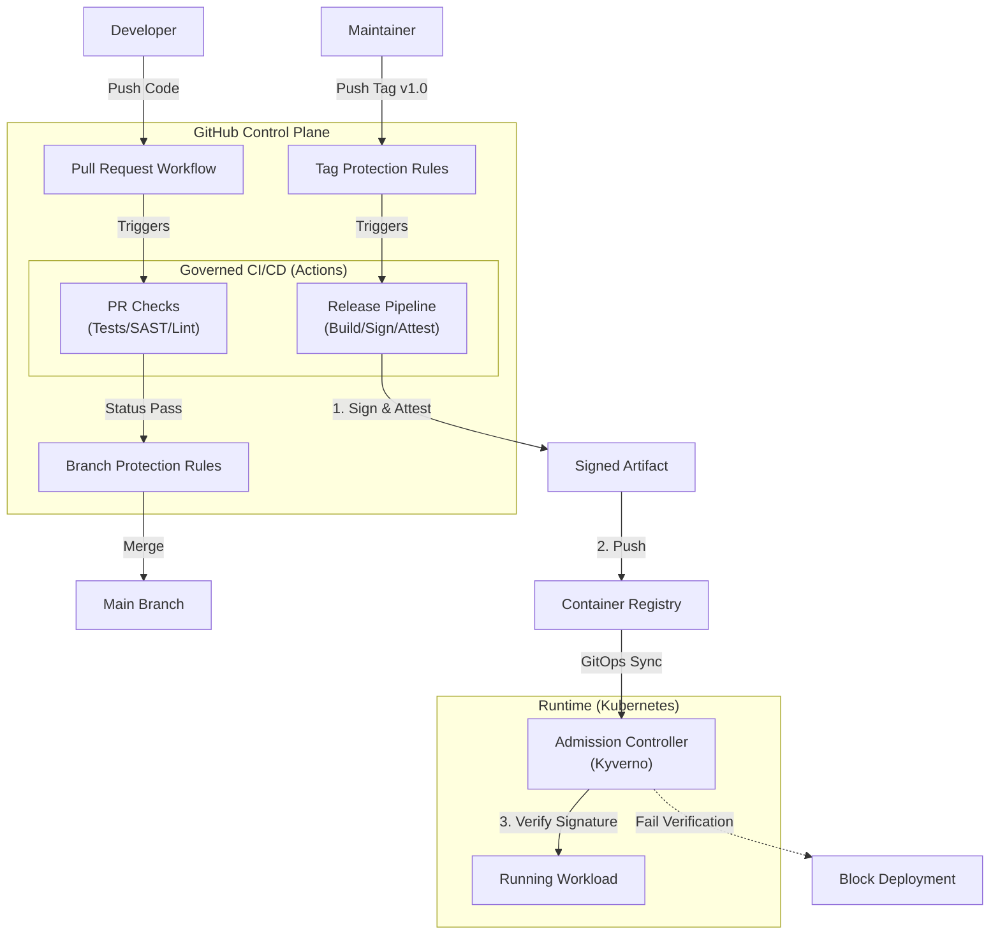

# Branch Protection & Governance Model

> [!NOTE]
> **Objective**: Make governance controls non-bypassable, even for contributors with write access.
> This turns GitHub itself into part of the control plane.

This model ensures that no artifact can reach production unless it passes policy-defined quality, security, and provenance requirements, enforced before, during, and after CI execution.

## Summary

This Branch Protection Model ensures that:

- CI pipelines are policy-constrained
- Releases are workflow-controlled
- Artifacts are provable, auditable, and enforceable
- Governance failures surface immediately — not after deployment

## GitHub as the Control Plane



```mermaid
flowchart TB
    %% Actors
    Dev[Developer]
    Admin[Admin / Maintainer]

    %% GitHub Control Plane
    subgraph GitHub["GitHub Control Plane"]
        BR[Branch Protection Rules]
        PR[Pull Request Workflow]
        TAG_RULE[Tag Protection Rules]
        
        subgraph CI["Governed CI/CD (Actions)"]
            Check["PR Checks<br/>(Tests/SAST/Lint)"]
            Build["Release Pipeline<br/>(Build/Sign/Attest)"]
        end
    end

    %% Standard Flow (Happy Path)
    Dev -->|Push Code| PR
    PR -->|Triggers| Check
    Check -->|Status Pass| BR
    BR -->|Merge| Main[Main Branch]
    
    %% Release Flow
    Admin -->|Push Tag v1.0| TAG_RULE
    TAG_RULE -->|Triggers| Build

    %% 🚨 BREAK-GLASS FLOW 🚨
    Admin -.->|🚨 EMERGENCY BYPASS<br/>(Audit Logged)| Main

    %% Artifact Flow
    Build -->|1. Sign & Attest| IMG["Signed Artifact"]
    IMG -->|2. Push| REG[Container Registry]

    %% Runtime
    subgraph RUNTIME["Runtime (Kubernetes)"]
        ADM["Admission Controller<br/>(Kyverno)"]
        POD[Running Workload]
    end

    REG -->|GitOps Sync| ADM
    ADM -->|3. Verify Signature| POD
    ADM -.->|Fail Verification| BLOCK[Block Deployment]

    %% Styles
    style Admin fill:#f96,stroke:#333,stroke-width:2px
    style ADM fill:#f9f,stroke:#333,stroke-width:2px
    style BLOCK fill:#ff9999,stroke:#333,stroke-width:1px
    
    %% Highlight the Emergency Link in Red
    linkStyle 5 stroke:red,stroke-width:3px,stroke-dasharray: 5 5;
```


> Key Principle:
> Governance is enforced before code merges, during artifact creation, and at runtime admission, ensuring that CI pipelines cannot be weakened without detection or enforcement failure.

---

## 1. High-Level Policy (What is Enforced)

For the default branch (`main`):

- 🚫 No direct pushes
- 🔁 All changes must go through Pull Requests
- ✅ All required quality and security checks must pass
- 🏷️ Releases occur only via protected, signed tags
- 🔐 Every artifact is cryptographically linked to:
  - A specific commit
  - A governed CI workflow
  - An SBOM and vulnerability attestations
- 🧭 Governance is enforced before CI executes user-defined logic

This directly supports the design goal:
> “The CI/CD pipeline acts as the primary control plane for quality, security, and traceability.”
---

## Branch Protection Ruleset

**Main Branch (`main`)**
**Ruleset Name: `main`**

**Pull Request Enforcement**

- ✅ Require a pull request before merging
- ✅ Minimum approvals: 1
- ✅ Dismiss stale approvals on new commits
- ⚠️ Require CODEOWNER review
(Optional, but strongly recommended for governance-sensitive files)

**Required Status Checks*"

- ✅ Require status checks to pass before merging
- ✅ Only explicitly selected jobs are allowed:
  - Code Quality & Security Gates
  - Dockerfile Linting
  - DAST (OWASP ZAP)
>❗ Release / signing jobs are intentionally excluded here and enforced via protected tags instead.

**Merge Safety**

- ✅ Require branch to be up to date before merging
- 🚫 Allow force pushes → Disabled
- 🚫 Allow deletions → Disabled
- 🚫 Allow bypassing branch protections → Disabled

**Merge Strategy**
- ❌ Merge commits disabled
- ✅ Squash merges only
  (Ensures linear history and clean provenance mapping)

## 🔐 Protected Release Tags

Tag protection ensures that release creation is not user-driven, but workflow-driven.

#### Tag Rule

- Pattern: v*
- Restrictions:
  - Only GitHub Actions may create tags
  - Optional: Repository Administrators (break-glass) 

This guarantees:
- Releases cannot be created manually
- All releases originate from governed workflows
- Provenance and attestations always map to trusted CI execution

---

## 🔐 Production Environment Rules

Environment: `production`

#### Deployment Controls

- ✅ Required reviewers:
  - Security Approver (or repository owner)
- ✅ Deployment branch restrictions:
  - Allowed ref type: Tags
  - Pattern: v*

This enforces separation of duties:

- Code authors cannot unilaterally deploy
- Production is reachable only via a release artifact

---

## CODEOWNERS

```text
# `.github/CODEOWNERS`
# Governance ownership
.github/workflows/*  @agslima
k8s/**               @agslima
docs/security-debt.md @agslima
```

#### Effect:

Prevents silent modification of governance logic
Forces explicit review for:

- CI/CD pipelines
- Runtime policies
- Risk acceptance documentation


## Threat Model Addressed

This model explicitly defends against:

- Rogue developers removing security steps from CI
- Weakening scans while still producing “valid” artifacts
- Bypassing governance via direct pushes or manual tags
- Drift between documented security posture and runtime reality
- Even if a weakened pipeline produces a signed artifact:
- Runtime admission policies enforce cryptographic proof that mandatory scans were executed.
