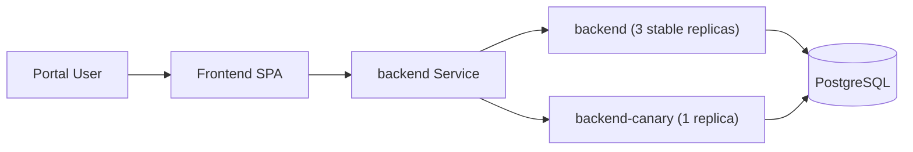
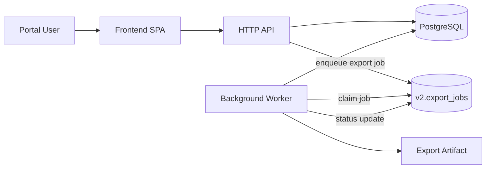

# Architecture and Repository Structure

[//]: # (owner: Project Maintainers)
[//]: # (review_cadence: Quarterly)
[//]: # (last_reviewed: 2026-04-11)

This repository is organized to separate application logic, infrastructure definition, and governance policies. That structure supports a shift-left model in which policy testing happens alongside application testing and delivery controls remain reviewable as code.

## Repository Map

### 1. Workload: `app/`

This area contains the source code and build definitions for the workload application.

- `Dockerfile`: defines the immutable build artifact
- `server/`: Node.js backend logic and the shared domain code used by both HTTP and worker runtimes
- `server/tests/`: unit tests that validate code behavior before deeper security controls run

The runtime model now includes two application-side execution modes:

- an HTTP API runtime for request-response handling
- a background worker runtime for asynchronous prescription export generation

### 2. Policy Engine: `policies/` and `k8s/policies/`

This is the core of the governance model. Policies are treated as code, versioned, and tested.

- `policies/*.rego`: OPA rules used for static analysis
  Example: `dockerfile.rego` ensures no root users or `:latest` tags are used during the build.
- `k8s/policies/`: Kyverno policies used for delivery validation and admission control
- `k8s/policies/ci/`: policies validated inside GitHub Actions during CI
- `k8s/policies/cluster/`: policies evaluated by the GitOps enforcement workflow before promotion and enforced again by the Kubernetes admission controller at deployment time
- `k8s/policies/pod-hardening.yaml`: baseline security standards such as restricting privilege escalation

### 3. Infrastructure as Code: `k8s/`

This area defines the desired Kubernetes runtime state of the application.

- `base/`: base manifests for backend, worker, frontend, disruption budgets, and examples
- `overlays/`: environment overlays such as `dev` and `prod`, where release digests are promoted
- `tests/`: infrastructure unit tests and fixtures

GitOps promotion updates `k8s/overlays/prod/kustomization.yaml` after the governed release path succeeds.
The production overlay now models the backend as a stable/canary split:

- `backend`: last known-good backend digest
- `backend-canary`: candidate backend digest under observation
- `backend`: shared Service selecting both tracks

That rollout is intentionally simple and replica-weighted.
The repository does not currently model service-mesh traffic splitting.

### 4. Governance Logic: `scripts/` and `docs/`

These paths bridge the gap between tool output and business or operational decisions.

- `scripts/check-security-debt.sh`: implements the risk-acceptance logic against `docs/security-debt.md`
- `scripts/check-governance-drift.sh`: checks documentation and evidence references for governance drift
- `scripts/check-governance-metadata-freshness.sh`: enforces freshness of tracked governance metadata
- `docs/`: governance, architecture, ADRs, threat analysis, and operator guidance

## Data Flow Through the Structure

1. Code change
   A commit or pull request triggers the pipeline.
2. Application validation
   `app/` is tested and scanned, including Trivy, Gitleaks, and ZAP in the appropriate flows.
3. Policy check during build
   `app/Dockerfile` and related manifests are checked against policy definitions in `policies/` and `k8s/policies/`.
4. Artifact creation
   Container images for backend, worker, and frontend are built, published by digest, and signed or attested through the trusted release path.
5. GitOps update
   If all gates pass, the pipeline updates `k8s/overlays/prod/kustomization.yaml`.
   Worker and frontend digests move directly.
   Backend candidate rollout begins by advancing the canary digest while stable remains pinned.
6. Policy check during promotion
   The GitOps enforcement workflow renders `k8s/overlays/prod` and validates the result against `k8s/policies/cluster` with the Kyverno CLI before opening the promotion PR.
7. Runtime admission
   The Kubernetes cluster re-applies the Kyverno cluster policies when the promoted manifests are deployed.

## Progressive Rollout Update

The production backend deployment model now distinguishes between:

- stable capacity that continues serving trusted production traffic
- candidate capacity that receives limited exposure during the canary window

Why this matters:

- risky backend releases can be introduced gradually
- stable and candidate state stay explicit in Git-managed manifests
- promotion becomes a governed decision rather than an implicit side effect of image publication
- the repository demonstrates progressive delivery without introducing a service mesh control plane

## Runtime Architecture Update

The workload is no longer modeled as only a single request-response API.
It now includes an asynchronous processing path for prescription export generation.

Why this matters:

- export generation should not hold open a user request until completion
- retries and failure handling belong to a worker lifecycle, not an HTTP request lifecycle
- the platform now has to manage more than a single stateless API container
- Kubernetes now carries separate deployment concerns for the API and worker, including independent health probes and rollout behavior

## Design Boundaries

| Directory | Architectural pattern | Purpose |
| :--- | :--- | :--- |
| `app/` | Workload isolation | Keeps application logic separate from governance and policy code |
| `k8s/tests/` | Test-driven infrastructure | Ensures policies and manifest expectations are validated before they affect promotion or deployment |
| `policies/` | Policy as code | Decouples security rules from workflow YAML and keeps them reviewable |
| `scripts/` | Governance as code | Codifies decision logic such as debt handling, metadata freshness, and governance drift checks |
| `docs/` | Governance evidence | Preserves the human-readable rationale, trust boundaries, and operational guidance that back the automated controls |
