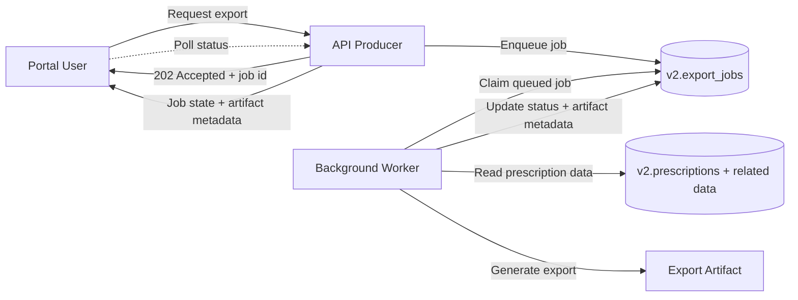

# Async Workflow Design

[//]: # (owner: Project Maintainers)
[//]: # (review_cadence: Quarterly)
[//]: # (last_reviewed: 2026-04-11)

## Chosen Use Case

The repository introduces one asynchronous business flow:

- prescription export generation

## Why a Worker Exists

Prescription export generation is a better fit for asynchronous processing than synchronous request-response handling because it can:

- take longer than a normal API request
- involve multiple read and formatting steps
- be retried safely when transient failures occur
- complete after the requesting user has disconnected

The worker exists so the API can accept export requests quickly while export generation happens in a separate controlled runtime.

## Workflow Summary

The flow is intentionally simple and governance-friendly:

1. API receives a prescription export request.
2. API records an export job in a database-backed queue.
3. Worker claims queued jobs.
4. Worker generates the export artifact and updates job status.
5. API exposes completion state and artifact metadata to the caller.

## Components

### Producer

The producer is the backend API.

Responsibilities:

- validate the export request
- authorize the caller
- create an export job record
- return an accepted response with a job identifier

Recommended request shape:

- `POST /api/v2/prescriptions/:id/exports`

Recommended immediate response:

- HTTP `202 Accepted`
- export job id
- initial status `queued`

### Queue

The queue is a database-backed job table rather than a new infrastructure dependency.

Recommended queue object:

- `v2.export_jobs`

Recommended fields:

- `id`
- `prescription_id`
- `requested_by_user_id`
- `status` (`queued`, `processing`, `succeeded`, `failed`)
- `attempt_count`
- `available_at`
- `started_at`
- `completed_at`
- `last_error`
- `artifact_location`
- `created_at`
- `updated_at`
- `idempotency_key`

Why use a database-backed queue here:

- the repository already depends on PostgreSQL
- it keeps the async design reviewable without introducing Redis or another broker yet
- job state remains auditable in the same governed persistence layer

### Worker

The worker is a separate runtime component from the HTTP API.

Responsibilities:

- poll for available queued jobs
- claim one job at a time using safe locking semantics
- load prescription data
- generate the export artifact
- update job state and metadata

The worker should not serve user traffic.
Its trust boundary and scaling concerns differ from the API runtime.

### Completion Behavior

Completion is modeled through job state, not by keeping the original request open.

Recommended completion behavior:

- API offers a job status endpoint such as `GET /api/v2/exports/:jobId`
- successful jobs expose artifact metadata and completion timestamp
- failed jobs expose retry state and the last non-sensitive error summary

## Failure and Retry Expectations

Failures are expected and must be explicit.

Transient failures:

- database connection interruption
- temporary filesystem or artifact-write failure
- worker restart while processing

Expected handling:

- retry automatically
- increment `attempt_count`
- move `available_at` forward using backoff

Non-retryable failures:

- prescription record not found at processing time
- invalid export request parameters
- authorization state no longer permits export

Expected handling:

- mark job `failed`
- do not retry automatically
- preserve a safe error summary in `last_error`

Recommended retry guardrails:

- bounded automatic retries, for example `max_attempts = 5`
- exponential or stepped retry delay
- terminal failure state after retry exhaustion

### Poison Handling

The queue must have an explicit terminal state for poison jobs.

Policy:

- jobs that exhaust retry budget move to `failed`
- jobs that encounter a known non-retryable condition move directly to `failed`
- failed jobs stay queryable through the job status API and do not disappear from the queue table
- re-submitting the same export request requeues the failed job instead of creating an unbounded duplicate

This repository uses the `failed` state as the dead-letter equivalent for the first async workflow.

## Idempotency and Duplicate Delivery Assumptions

The worker must assume duplicate delivery can happen.

Duplicate scenarios include:

- a worker crashes after doing work but before clearing the lease
- a lease expires and another worker claims the same job
- a caller submits the same export request multiple times

Idempotency rules:

- export jobs use an `idempotency_key` derived from prescription id, export format, and the prescription row version timestamp
- duplicate enqueue requests for the same prescription version reuse the existing queued, processing, or completed job
- duplicate enqueue requests for a failed job requeue that same failed job for another attempt
- worker execution is side-effect safe because the export artifact is written back onto the job row, so duplicate completion attempts overwrite the same logical result instead of creating divergent records

Operational assumption:

- at-least-once delivery is acceptable for this workflow
- exactly-once delivery is not assumed
- correctness depends on idempotent job handling, not on perfect broker behavior

## Delivery and Observability Expectations

The async flow should remain observable and auditable.

Expected signals:

- queued job count
- in-flight job count
- failed job count
- retry count
- export completion latency

Expected logs:

- job created
- job claimed
- job succeeded
- job failed
- retry scheduled

## Concrete Partial Failure Example

The canonical worked example is [`async-failure-scenario-worker-retry.md`](async-failure-scenario-worker-retry.md).

That scenario demonstrates:

- API success before worker success
- temporary worker loss after a claim
- stale lease recovery
- eventual retry success without duplicate job creation

## Architecture Diagram

## Why This Flow Is a Good First Async Example

This use case demonstrates a real second runtime component without requiring a large platform jump.

It shows:

- why background work should be decoupled from HTTP latency
- how queue state and worker state differ from API state
- how retryable work needs explicit status modeling

That makes it a strong first example for the repository's move beyond a pure request-response application.
