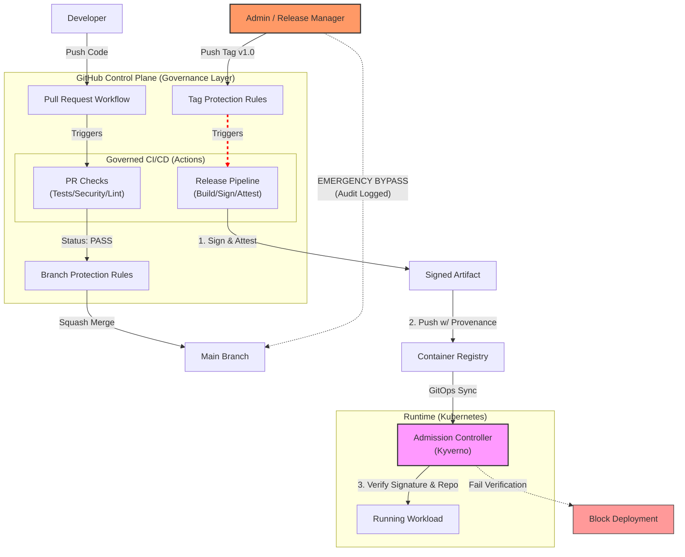

# Branch Protection & Governance Model

> [!NOTE]
> **Objective**: Make governance controls non-bypassable, even for contributors with write access.
> This turns GitHub itself into part of the control plane.

This model ensures that no artifact can reach production unless it passes policy-defined quality, security, and provenance requirements, enforced before, during, and after CI execution.

## Summary

This Branch Protection Model ensures that:

- CI pipelines are policy-constrained
- Releases are workflow-controlled
- Artifacts are provable, auditable, and enforceable
- Governance failures surface immediately — not after deployment

## GitHub as the Control Plane



> Key Principle:
> Governance is enforced before code merges, during artifact creation, and at runtime admission, ensuring that CI pipelines cannot be weakened without detection or enforcement failure.

---

## 1. High-Level Policy (What is Enforced)

For the default branch (`main`):

- 🚫 No direct pushes
- 🔁 All changes must go through Pull Requests
- ✅ All required quality and security checks must pass
- 🏷️ Releases occur only via protected, signed tags
- 🔐 Every artifact is cryptographically linked to:
  - A specific commit
  - A governed CI workflow
  - An SBOM and vulnerability attestations
- 🧭 Governance is enforced before CI executes user-defined logic

This directly supports the design goal:
> “The CI/CD pipeline acts as the primary control plane for quality, security, and traceability.”
---

## Branch Protection Ruleset

**Main Branch (`main`)**
**Ruleset Name: `main`**

**Pull Request Enforcement**

- ✅ Require a pull request before merging
- ✅ Minimum approvals: 1
- ✅ Dismiss stale approvals on new commits
- ⚠️ Require CODEOWNER review
(Optional, but strongly recommended for governance-sensitive files)

**Required Status Checks**

- ✅ Require status checks to pass before merging
- ✅ Only explicitly selected jobs are allowed:
  - Code Quality (server/client)
  - Infra Hygiene (Hadolint/Conftest/Kubeconform)
  - Security Quality Check (Gitleaks + Trivy FS)
>❗ Release / signing jobs are intentionally excluded here and enforced via protected tags instead.

**Merge Safety**

- ✅ Require branch to be up to date before merging
- 🚫 Allow force pushes → Disabled
- 🚫 Allow deletions → Disabled
- 🚫 Allow bypassing branch protections → Disabled

**Merge Strategy**
- ❌ Merge commits disabled
- ✅ Squash merges only
  (Ensures linear history and clean provenance mapping)

## 🔐 Protected Release Tags

Tag protection ensures that release creation is not user-driven, but workflow-driven.

#### Tag Rule

- Pattern: v*
- Restrictions:
  - Tags initiate the immutable release pipeline. While Admins trigger the tag, the Artifact is only trusted if produced by the workflow triggered by that specific tag.
  - Optional: Repository Administrators (break-glass) 

This guarantees:
- All releases originate from governed workflows
- Provenance and attestations always map to trusted CI execution

---

## 🔐 Production Environment Rules

Environment: `production`

#### Deployment Controls

- ✅ Required reviewers:
  - Security Approver (or repository owner)
- ✅ Deployment branch restrictions:
  - Allowed ref type: Tags
  - Pattern: v*

This enforces separation of duties:

- Code authors cannot unilaterally deploy
- Production is reachable only via a release artifact

---

## 🛡️ Change Management (`CODEOWNERS`)

This project utilize GitHub's native `CODEOWNERS` feature to enforce a strict **"Separation of Duties" model**. 

### Implementation

```bash
# ==================================
# GOVERNANCE ENFORCEMENT ZONES
# ==================================

# 1. Pipeline Integrity
.github/workflows/    @agslima

# 2. Policy Definitions
k8s/policies/         @agslima
policies/             @agslima

# 3. Risk Acceptance
docs/security-debt.md @agslima

# 4. Infrastructure State
k8s/resources/        @agslima
```

The `.github/CODEOWNERS` file defines the following enforcement zones:
 * **Anti-Tampering:** A developer cannot disable the trivy-scan job in the CI pipeline to force a bad build through. The PR modifying the .yml file will automatically block merging until the Code Owner approves.
 * **Risk Accountability:** Adding an entry to security-debt.md (to ignore a vulnerability) is treated as a business decision, not a code change. It triggers a mandatory review from the Security Owner.
 * **Infrastructure Stability:** Changes to Kubernetes manifests (k8s/resources) are gated to ensure they comply with cluster capacity and architectural standards.

> Enforcement Note: This control is active only when the "Require review from Code Owners" setting is enabled in the Branch Protection Rules.

#### Effect:

Prevents silent modification of governance logic
Forces explicit review for:

- CI/CD pipelines
- Runtime policies
- Risk acceptance documentation

## Threat Model Addressed

This model explicitly defends against:

- Rogue developers removing security steps from CI
- Weakening scans while still producing “valid” artifacts
- Bypassing governance via direct pushes or manual tags
- Drift between documented security posture and runtime reality
- Even if a weakened pipeline produces a signed artifact:
- Runtime admission policies enforce cryptographic proof that mandatory scans were executed.

---

## Verification (How to Audit)

### Verify Image Signature

```bash
# 1. Export a release image digest (backend or frontend)
export IMAGE="docker.io/agslima/app-stayheathy-backend@sha256:<digest>"

# 2. Verify the signature against the OpenID Connect (OIDC) identity
cosign verify "$IMAGE" \
  --certificate-identity-regexp "^https://github.com/agslima/software-delivery-pipeline/.github/workflows/ci-release-gate\\.yml@refs/tags/v.*" \
  --certificate-oidc-issuer "https://token.actions.githubusercontent.com" | jq .
  ```

### Verify SLSA Provenance

```bash
# Verify the attestation (SLSA Level 3)
cosign verify-attestation "$IMAGE" \
  --type "https://slsa.dev/provenance/v1" \
  --certificate-identity-regexp "^https://github.com/agslima/software-delivery-pipeline/.github/workflows/ci-release-gate\\.yml@refs/tags/v.*" \
  --certificate-oidc-issuer "https://token.actions.githubusercontent.com" | jq .payload -r | base64 -d | jq .
  ```

### Verify active rules 

To verify that these rules are active and working:

**1. Attempt a Direct Push:**

```bash
   git checkout main
   touch illegal_file.txt
   git push origin main
   # Expected: remote: error: GH006: Protected branch update failed
```

**2. Attempt Unsigned Deployment:**

Deploy an image built locally (not by CI) to the cluster.

```bash
  kubectl apply -f k8s/tests/resources/invalid-unsigned.yaml
  # Expected: Error from server: admission webhook "validate.kyverno.svc" denied the request
```
