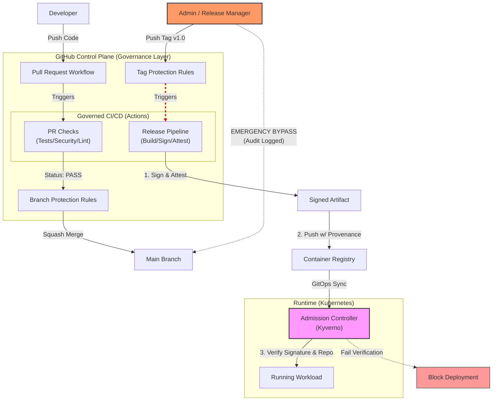

# Delivery Governance Model

> [!NOTE]
> Objective: make governance controls difficult to bypass silently for standard contributors with write access, and ensure that trusted release and deployment paths remain policy-constrained, auditable, and verifiable.
>
> In this model, GitHub provides the repository governance layer, trusted CI workflows extend governance into artifact creation, and Kubernetes admission policy extends governance into deployment acceptance.

This document defines the repository's delivery governance model: how changes are controlled, how releases become trusted, and how runtime policy validates that only governed artifacts are eligible for deployment.
Within the trust boundaries described below, promotion toward production depends on policy-defined quality, security, and provenance controls enforced across repository protections, trusted CI workflows, and runtime admission checks.

## Governance Metadata and Freshness

- **Validation cadence:** Quarterly
- **Last validated:** 2026-04-11

Governance metadata must remain current enough to support audit credibility. The repository enforces freshness with:

- Policy file: `.github/governance-metadata-policy.json`
- Override file: `.github/governance-metadata-overrides.json`
- CI entrypoint: `scripts/check-governance-metadata-freshness.sh`
- PR workflow step: `.github/workflows/ci-pr-validation.yml` -> `governance-and-security-scan`

Tracked documents fail CI when their `last_reviewed` or `Last validated` value exceeds the declared cadence window in `.github/governance-metadata-policy.json`.

Use a temporary override only when metadata cannot be refreshed before merge and delaying the change would create more risk than carrying a short, explicit exception. Each override in `.github/governance-metadata-overrides.json` must include:

- `path`
- `field`
- `approved_by`
- `ticket`
- `reason`
- `allow_stale_until`

Override expectations:

- time-bound: `allow_stale_until` must be an explicit UTC date
- justified: `reason` must explain why the metadata update is temporarily deferred
- approved: `approved_by` must identify the maintainer or governance approver accepting the exception
- reviewable: `ticket` must link the exception to a tracked work item or audit record

Remove the override as soon as the metadata is refreshed. Do not use recurring or open-ended overrides.

## Summary

This governance model is designed so that:

- pull requests are constrained by required quality and security checks
- trusted releases originate from protected tags and governed workflows
- promoted artifacts carry verifiable identity, provenance, and security evidence
- deployment depends on repository and runtime policy alignment
- governance drift is intended to surface through failed checks, blocked promotion, denied admission, or audit review

## Trust Boundaries and Assumptions

This document describes governance within the normal repository-to-release-to-deployment path. It assumes:

- GitHub branch, tag, and environment protections remain enabled and correctly configured
- `.github/CODEOWNERS` is present and enforced
- GitHub OIDC identity issuance is trusted for workflow identity
- the target container registry stores signatures and attestations correctly
- the target Kubernetes environment enforces Kyverno validation policies
- privileged administrative actions outside the standard delivery path are separately governed and auditable

This model is intended to prevent or expose silent bypass by standard contributors with write access. It does not claim immunity to every privileged action outside the documented trust boundaries.

## Repository Governance Flow

The flow below shows the normal governed path for pull requests, release creation, and runtime verification, along with the existence of a privileged emergency path that must remain explicit and auditable.


```mermaid
flowchart TB
    Dev[Developer]
    Admin[Admin / Release Manager]

    subgraph GitHub["GitHub Control Plane (Governance Layer)"]
        direction TB
        BR[Branch Protection Rules]
        PR[Pull Request Workflow]
        TAG_RULE[Tag Protection Rules]

        subgraph CI["Governed CI/CD (Actions)"]
            Check["PR Checks<br/>(Tests/Security/Lint)"]
            Build["Release Pipeline<br/>(Build/Sign/Attest)"]
        end
    end

    Dev -->|Push Code| PR
    PR -->|Triggers| Check
    Check -->|Status: PASS| BR
    BR -->|Squash Merge| Main[Main Branch]

    Admin -->|Push Tag v1.0| TAG_RULE
    TAG_RULE -->|Triggers| Build

    Admin -.->|"EMERGENCY BYPASS<br/>(Audit Logged)"| Main

    Build -->|1. Sign & Attest| IMG["Signed Artifact"]
    IMG -->|2. Push w/ Provenance| REG[Container Registry]

    subgraph RUNTIME["Runtime (Kubernetes)"]
        ADM["Admission Controller<br/>(Kyverno)"]
        POD[Running Workload]
    end

    REG -->|GitOps Sync| ADM
    ADM -->|3. Verify Signature & Repo| POD
    ADM -.->|Fail Verification| BLOCK[Block Deployment]

    style Admin fill:#f96,stroke:#333,stroke-width:2px
    style ADM fill:#f9f,stroke:#333,stroke-width:2px
    style BLOCK fill:#ff9999,stroke:#333,stroke-width:1px

    linkStyle 5 stroke:red,stroke-width:3px,stroke-dasharray: 5 5;
```

> Key principle:
> governance is enforced before code merges, during artifact creation, and at runtime admission, so CI pipelines cannot be weakened without detection or enforcement failure.

## Control Model

This model uses three kinds of controls:

- **Preventive controls:** branch protection, required checks, CODEOWNERS review, protected tags, and environment reviewers
- **Detective controls:** scheduled deep scans, artifacts, SARIF outputs, audit logs, and quarterly verification
- **Enforcing controls:** release gates and runtime admission policies that validate signature and attestation requirements

Not every failure mode is blocked at the same layer. Some are prevented before merge, some at release time, and some surface only at deployment admission or audit review. Runtime enforcement acts as the compensating boundary when an upstream workflow control is weakened, misconfigured, or bypassed.

Threats this model is intended to prevent or expose:

- standard contributors removing or weakening security steps from CI
- producing apparently valid artifacts from an untrusted or weakened release path
- bypassing governance through direct pushes or manual release creation
- drift between documented security posture, repository settings, and runtime enforcement
- attempting deployment of unsigned or insufficiently attested artifacts

## Governance Control Surfaces

The governance model in this document depends on repository settings for branch protection, CODEOWNERS enforcement, protected release tags, and production environment restrictions. The detailed expected configuration is defined in the control sections below.

### Branch Protection Ruleset

**Scope:** `main`

The default branch must remain protected so that changes enter through reviewed pull requests and current governance-critical checks.

Expected controls:

- require a pull request before merging
- require at least one approving review
- dismiss stale approvals on new commits
- require the branch to be up to date before merging
- require status checks to pass before merging
- require review from Code Owners
- disable force pushes
- disable branch deletion
- disable bypass permissions for branch protections
- allow only squash merges

Required checks should stay limited to governance-critical PR signals. Release-signing controls are intentionally enforced later through protected tags and the trusted release workflow, not as PR checks.

### Protected Release Tags

Release integrity depends on protected release tags, not ad hoc artifact publication.

Expected controls:

- protected tag pattern `v*.*.*`
- tag creation restricted to trusted maintainers or release managers
- release trust granted only to artifacts produced by the governed workflow triggered from that protected tag

This keeps release creation auditable and ensures provenance and attestations map back to trusted CI execution.

### Production Environment Rules

**Environment:** `production`

Production access should remain separate from authoring and merge permissions.

Expected controls:

- required reviewers enabled for production deployments
- deployment branch restriction limited to tags
- allowed tag pattern `v*.*.*`

This enforces separation of duties: code authors cannot unilaterally deploy, and production is reachable only through a release artifact on the governed path.

### Governance-Sensitive Ownership Controls

This project uses GitHub `CODEOWNERS` to protect governance-sensitive files and require explicit accountable review.

Key enforcement zones include:

- `.github/workflows/`
- `k8s/policies/`
- `policies/`
- `docs/security-debt.md`
- `k8s/base/`
- `k8s/overlays/`
- `k8s/tests/`

Control intent:

- prevent silent modification of CI/CD and governance logic
- treat risk acceptance as an explicit accountable decision
- require review on runtime-policy and infrastructure-state changes

This control is effective only when `Require review from Code Owners` remains enabled in branch protection.

### Database Schema Change Governance

Database schema evolution is part of release integrity because application and data changes must remain safe across rollout and rollback windows.

Required strategy:

- expand-and-contract
- backward-compatible first release
- destructive cleanup only after a later release has removed old dependencies

Normative policy:

- [`docs/database-migration-strategy.md`](database-migration-strategy.md)
- [`docs/adr/008-database-migration-strategy.md`](adr/008-database-migration-strategy.md)
- [`docs/schema-change-deployment-procedure.md`](schema-change-deployment-procedure.md)
- [`docs/database-migration-demo-prescription-status.md`](database-migration-demo-prescription-status.md)

Reviewer expectations for schema-changing PRs:

- the PR identifies whether it is an expand, cutover, or cleanup change
- the first release remains compatible with both old and new schema expectations relevant to rollout
- data backfill or dual-write needs are explicit when required
- destructive actions such as drop, rename without compatibility, or immediate hardening against live dirty data are rejected unless they are explicitly approved as an exception

Unsafe migration patterns are forbidden because they can make deployment appear successful while breaking rollback, mixed-version safety, or data integrity.
The PR workflow also runs a dedicated migration safety check that flags schema-impacting changes without migrations and requires explicit exception metadata for potentially destructive migration operations.
Release sequencing is also explicit: pre-deploy expand steps, application rollout, and post-deploy cleanup must remain separate governed phases.

### Progressive Rollout Governance

Risky backend releases may enter production through a controlled canary state rather than full immediate replacement.

Required strategy:

- replica-weighted canary in the production backend overlay
- explicit stable and canary manifest state
- explicit promotion evidence before stable moves
- explicit rollback triggers during the observation window

Normative policy:

- [`docs/canary-rollout-strategy.md`](canary-rollout-strategy.md)
- [`docs/rollout-gates-policy.md`](rollout-gates-policy.md)
- [`docs/canary-promotion-checklist.md`](canary-promotion-checklist.md)
- [`docs/canary-rollout-walkthrough.md`](canary-rollout-walkthrough.md)
- [`docs/adr/009-progressive-delivery-canary-strategy.md`](adr/009-progressive-delivery-canary-strategy.md)

Reviewer and operator expectations:

- the production backend stable digest remains identifiable during canary evaluation
- the candidate digest is distinguishable from stable by manifest state and labels
- promotion does not proceed without canary evidence
- rollback conditions are explicit before rollout begins

## Workflow and Evidence Mapping

## README Claims → Controls Matrix

The authoritative claim-to-enforcement index lives in [`governance-evidence-index.md`](governance-evidence-index.md). Use that document as the single audit surface for README claims, workflow jobs, policy enforcement points, artifact paths, ownership, and review cadence.

### Governance Evidence Index

This section exists as the compatibility anchor for repository drift checks and README links. Treat the evidence index above as the authoritative detailed matrix.

### Controls-to-Workflow Mapping

Use this table during reviews to ensure governance controls remain mapped to active workflows and to detect drift when workflow names or job names change.

| Governance control | Workflow / job source | Enforcement signal |
| :--- | :--- | :--- |
| PR lint/test quality gate | `.github/workflows/ci-pr-validation.yml` -> `code-quality` | Required PR status check passes before merge |
| Dockerfile, manifest, and policy hygiene | `.github/workflows/ci-pr-validation.yml` -> `infra-lint` | Required PR status check passes before merge |
| Governance drift and metadata freshness | `.github/workflows/ci-pr-validation.yml` -> `governance-and-security-scan` | Required PR status check fails on governance drift or stale metadata, blocking merge until corrected |
| Secret and vulnerability PR gate | `.github/workflows/ci-pr-validation.yml` -> `governance-and-security-scan` | Required PR status check passes before merge |
| Scheduled deep security evidence | `.github/workflows/ci-security-deep.yml` -> `security-governance` | Artifacts and SARIF generated; issue raised on failure |
| Release vulnerability gate by immutable digest | `.github/workflows/ci-release-gate.yml` -> `trivy-scan` | Release blocks on policy thresholds (`CRITICAL > 0` or `HIGH > 5`) for backend, worker, and frontend images |
| Release DAST gate | `.github/workflows/ci-release-gate.yml` -> `dast-analysis` | Release blocks on DAST gate criteria |
| Artifact signing, SBOM, and provenance attestations | `.github/workflows/ci-release-gate.yml` -> `sign-and-attest` | Attestations bound to trusted workflow identity for each deployable image |
| GitOps promotion manifest validation | `.github/workflows/gitops-enforce.yml` -> `gitops` | Promotion PR creation stops if Kyverno CLI policy evaluation fails; worker/frontend digests advance directly and backend canary digest advances without implicitly promoting stable |
| Backend release-in-progress governance | `k8s/overlays/prod/backend-rollout.yaml`; `docs/rollout-gates-policy.md`; `docs/canary-promotion-checklist.md` | Backend canary promotion requires explicit evidence, stable/canary distinction, and defined rollback triggers |

### SLSA Level Review and Requirement Mapping

Current documented posture is **SLSA Build L2 with L3-aligned controls in progress**. This is a posture statement, not a formal certification claim.

Why this statement is defensible:

- provenance is generated in the trusted release workflow via `actions/attest-build-provenance` and tied to immutable backend, worker, and frontend image digests
- release builds, scanning gates, signing, and attestations run in hosted CI with workflow identity constraints
- runtime and GitOps verification validate signature and required attestations, including SLSA provenance, before promotion or deployment
- some SLSA L3 expectations, such as independently validated hermetic or reproducible builds, are not yet fully evidenced in this repository

| SLSA requirement (build track) | Implemented control | Evidence source / workflow artifact |
| :--- | :--- | :--- |
| Provenance is generated for build outputs | `actions/attest-build-provenance` emits provenance for each release image digest | `.github/workflows/ci-release-gate.yml` (`sign-and-attest` job), registry attestation with predicate `https://slsa.dev/provenance/v1` |
| Provenance is bound to immutable artifact identity | Build and promotion use digest-pinned images; attestations and signatures reference digest subjects for backend, worker, and frontend | `digest-*` artifacts from the release workflow and digest-based image references in GitOps promotion |
| Trusted builder identity | OIDC-based keyless identity restricted to the release workflow on tag refs | Cosign verify identity regex in release verification and Kyverno `verify-slsa` policy subject regex |
| Build steps are policy-gated before trust is granted | Trivy and ZAP release gates must pass before `sign-and-attest` runs | `.github/workflows/ci-release-gate.yml` (`trivy-scan`, `dast-analysis`, `sign-and-attest`) |
| Non-falsifiable evidence retained for audit | Trivy and ZAP outputs, SBOMs, digests, and Kyverno logs uploaded as workflow artifacts | Release artifacts `trivy-results-*`, `zap-results`, `sbom-*`, `digest-*`, and GitOps artifact `kyverno-gitops-log` |
| Admission and runtime enforce provenance presence | Kyverno policy requires SLSA provenance attestation from a trusted issuer and workflow | `k8s/policies/cluster/verify-slsa.yaml` and GitOps `kyverno apply` output/log |

Treat this table as the requirement-by-requirement source of truth. Update it whenever workflow jobs, predicate types, or admission policies change.

## Governance Operations and Audit

### Governance Settings Audit Report Schema

The automated governance settings audit emits `governance-settings-audit/report.json` with this schema:

| Field | Type | Meaning |
| :--- | :--- | :--- |
| `schema_version` | string | Version for the audit report format and expectation set |
| `repository` | string | Audited repository in `owner/name` form |
| `mode` | string | `live` or `fixture` |
| `environment` | string | GitHub environment name audited |
| `generated_at` | string | UTC timestamp when the report was produced |
| `overall_status` | string | `pass` or `fail` |
| `summary.passed` | number | Count of passing checks |
| `summary.failed` | number | Count of failing checks |
| `checks[]` | array | Per-control results with `id`, `category`, `status`, `severity`, `expected`, `actual`, `source`, and `message` |

Use `summary.md` for quick review and `report.json` for durable quarterly evidence or downstream automation.

### Governance SLOs

Governance operating targets and the weekly report path are defined in [`governance-slos.md`](governance-slos.md).

Automated reporting source:

- workflow: `.github/workflows/ci-governance-slo-report.yml`
- artifact: `governance-slo-report`
- files: `summary.md`, `report.json`

### Verification (How to Audit)

Verify image signature:

```bash
export IMAGE="docker.io/agslima/app-stayhealthy-backend@sha256:<digest>"

cosign verify "$IMAGE" \
  --certificate-identity-regexp "^https://github.com/agslima/software-delivery-pipeline/.github/workflows/ci-release-gate\\.yml@refs/tags/v.*" \
  --certificate-oidc-issuer "https://token.actions.githubusercontent.com" | jq .
```

Verify SLSA provenance:

```bash
cosign verify-attestation "$IMAGE" \
  --type "https://slsa.dev/provenance/v1" \
  --certificate-identity-regexp "^https://github.com/agslima/software-delivery-pipeline/.github/workflows/ci-release-gate\\.yml@refs/tags/v.*" \
  --certificate-oidc-issuer "https://token.actions.githubusercontent.com" | jq .payload -r | base64 -d | jq .
```

Verify active rules:

1. Attempt a direct push:

```bash
git checkout main
touch illegal_file.txt
git push origin main
# Expected: remote: error: GH006: Protected branch update failed
```

2. Attempt unsigned deployment:

```bash
kubectl apply -f k8s/tests/resources/invalid-unsigned.yaml
# Expected: Error from server: admission webhook "validate.kyverno.svc" denied the request
```

### Quarterly Verification Checklist

Run this checklist at least once per quarter and record completion in the governance evidence trail, for example in release notes, an audit log, or a change ticket.

**Audit owner:** `@<github-handle>`  
**Verification date (UTC):** `YYYY-MM-DD`  
**Evidence link / ticket:** `<url-or-ticket-id>`

Automated evidence source:

- workflow: `.github/workflows/ci-governance-settings-audit.yml`
- artifact: `governance-settings-audit`
- files: `governance-drift-check.txt`, `summary.md`, `report.json`

- [ ] Confirm `main` still requires pull requests and blocks direct pushes.
- [ ] Confirm required status checks are still configured and match current governance-critical workflows.
- [ ] Confirm at least one approval and stale approval dismissal are enforced.
- [ ] Confirm `Require review from Code Owners` remains enabled.
- [ ] Confirm `.github/CODEOWNERS` still maps governance-sensitive paths to accountable owners.
- [ ] Confirm force pushes, deletions, and branch-protection bypass are disabled for `main`.
- [ ] Confirm protected release tag pattern `v*.*.*` exists and still restricts who can create release tags.
- [ ] Confirm the production deployment environment still restricts deployments to release tags and required reviewers.
- [ ] Confirm the latest `governance-settings-audit` artifact status is `pass` and attach its `summary.md` or `report.json` to the audit record.
- [ ] Confirm the latest `governance-slo-report` artifact reflects acceptable release-gate reliability, remediation lead time, and policy-test health, and attach `summary.md` or `report.json` to the audit record.
- [ ] Review the latest `governance-drift-check.txt` output from the quarterly `Governance Settings Audit` run, verify all README claims remain mapped to active workflows/jobs, and attach the artifact or workflow summary to the audit record.
- [ ] Confirm README claim and control wording still distinguishes posture evidence from release-blocking controls and remains aligned with `docs/threat-model.md`.
- [ ] Confirm any exceptions, including break-glass use or temporary metadata overrides, were documented, approved, and time-bounded.
