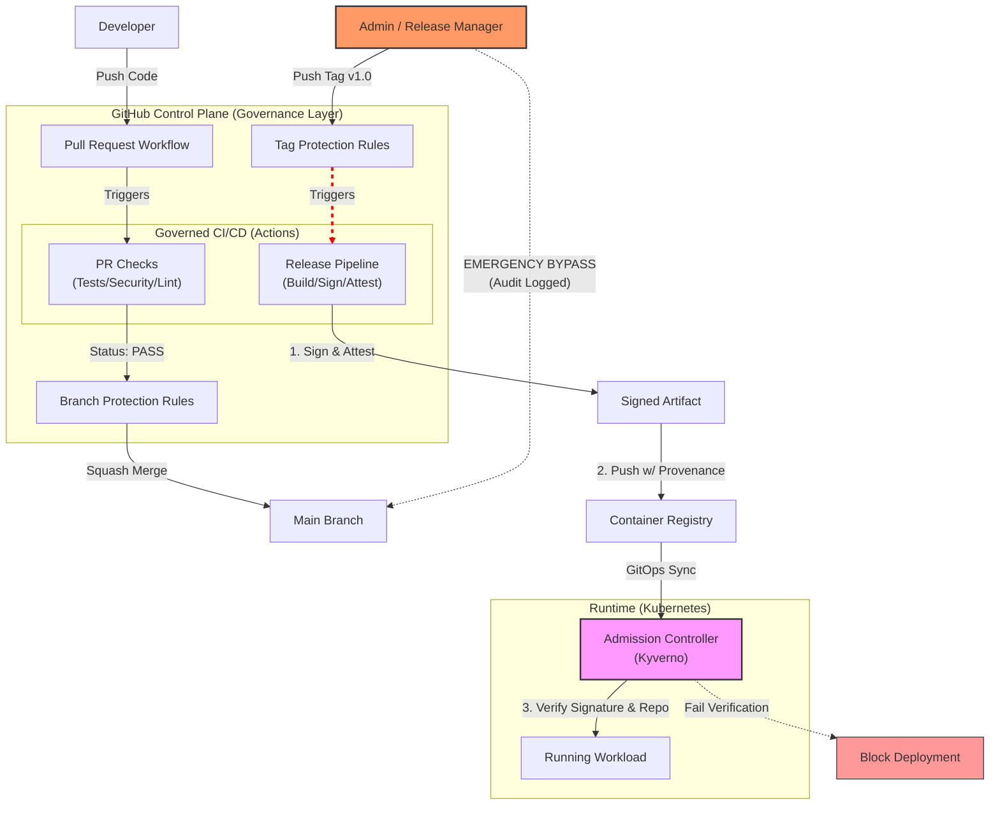

# Delivery Governance Model

> [!NOTE]
> Objective: Make governance controls difficult to bypass silently for standard contributors with write access, and ensure that trusted release and deployment paths remain policy-constrained, auditable, and verifiable.
> 
> In this model, GitHub provides the repository governance layer, trusted CI workflows extend governance into artifact creation, and Kubernetes admission policy extends governance into deployment acceptance

This document defines the repository’s delivery governance model: how changes are controlled, how releases become trusted, and how runtime policy validates that only governed artifacts are eligible for deployment.
Within the trust boundaries described below, promotion toward production depends on policy-defined quality, security, and provenance controls enforced across repository protections, trusted CI workflows, and runtime admission checks.

## Governance Metadata

- **Validation cadence:** Quarterly
- **Last validated:** 2026-03-11

## Summary

This governance model is designed so that:
- pull requests are constrained by required quality and security checks
- trusted releases originate from protected tags and governed workflows
- promoted artifacts carry verifiable identity, provenance, and security evidence
- deployment depends on repository and runtime policy alignment
- governance drift is intended to surface through failed checks, blocked promotion, denied admission, or audit review

---

## GitHub as the Control Plane

The flow below shows the normal governed path for pull requests, release creation, and runtime verification, along with the existence of a privileged emergency path that must remain explicit and auditable.


```mermaid
flowchart TB
    %% Actors
    Dev[Developer]
    Admin[Admin / Release Manager]

    %% GitHub Control Plane
    subgraph GitHub["GitHub Control Plane (Governance Layer)"]
        direction TB
        BR[Branch Protection Rules]
        PR[Pull Request Workflow]
        TAG_RULE[Tag Protection Rules]
        
        subgraph CI["Governed CI/CD (Actions)"]
            Check["PR Checks<br/>(Tests/Security/Lint)"]
            Build["Release Pipeline<br/>(Build/Sign/Attest)"]
        end
    end

    %% Standard Flow (Happy Path)
    Dev -->|Push Code| PR
    PR -->|Triggers| Check
    Check -->|Status: PASS| BR
    BR -->|Squash Merge| Main[Main Branch]
    
    %% Release Flow
    Admin -->|Push Tag v1.0| TAG_RULE
    TAG_RULE -->|Triggers| Build

    %% 🚨 BREAK-GLASS FLOW 🚨
    Admin -.->|"EMERGENCY BYPASS<br/>(Audit Logged)"| Main

    %% Artifact Flow
    Build -->|1. Sign & Attest| IMG["Signed Artifact"]
    IMG -->|2. Push w/ Provenance| REG[Container Registry]

    %% Runtime
    subgraph RUNTIME["Runtime (Kubernetes)"]
        ADM["Admission Controller<br/>(Kyverno)"]
        POD[Running Workload]
    end

    REG -->|GitOps Sync| ADM
    ADM -->|3. Verify Signature & Repo| POD
    ADM -.->|Fail Verification| BLOCK[Block Deployment]

    %% Styles
    style Admin fill:#f96,stroke:#333,stroke-width:2px
    style ADM fill:#f9f,stroke:#333,stroke-width:2px
    style BLOCK fill:#ff9999,stroke:#333,stroke-width:1px
    
    %% Highlight the Emergency Link in Red
    linkStyle 5 stroke:red,stroke-width:3px,stroke-dasharray: 5 5;
```

> Key Principle:
> Governance is enforced before code merges, during artifact creation, and at runtime admission, ensuring that CI pipelines cannot be weakened without detection or enforcement failure.

---
## Trust Boundaries and Assumptions

This document describes governance within the normal repository-to-release-to-deployment path. It assumes:
- GitHub branch, tag, and environment protections remain enabled and correctly configured
- `.github/CODEOWNERS` is present and enforced
- GitHub OIDC identity issuance is trusted for workflow identity
- the target container registry stores signatures and attestations correctly
- the target Kubernetes environment enforces Kyverno validation policies
- privileged administrative actions outside the standard delivery path are separately governed and auditable

This model is intended to prevent or expose silent bypass by standard contributors with write access. It does not claim immunity to every privileged action outside the documented trust boundaries.


## README Claims → Controls Matrix

The authoritative claim-to-enforcement index now lives in [`docs/governance-evidence-index.md`](docs/governance-evidence-index.md). Use that page as the single audit surface for README claims, workflow jobs, policy enforcement points, artifact paths, ownership, and review cadence.

## Required Repository Settings

To keep the governance claims in this document auditable and enforceable, the following repository settings must remain enabled in GitHub:

### Branch protections (`main`)

- ✅ Require pull requests before merging (direct pushes disabled)
- ✅ Require at least one approving review
- ✅ Dismiss stale pull request approvals when new commits are pushed
- ✅ Require branch to be up to date before merging
- ✅ Require status checks to pass before merging
- ✅ Restrict required checks to governance-critical jobs only
- ✅ Disable force pushes
- ✅ Disable branch deletion
- ✅ Disable bypass permissions for branch protections

### CODEOWNER enforcement

- ✅ A valid `.github/CODEOWNERS` file is present and maintained
- ✅ `Require review from Code Owners` is enabled in branch protection
- ✅ Governance-sensitive paths remain mapped to accountable owners

### Tag protections (release integrity)

- ✅ Protected tag pattern is configured for release tags (`v*.*.*`)
- ✅ Tag creation is restricted to trusted maintainers / release managers
- ✅ Release pipeline is triggered from protected tags, not manual artifact uploads

### Controls-to-Workflow Mapping

Use this table during reviews to ensure governance controls remain mapped to active workflows (and to detect drift when workflow names/jobs change).

| Governance Control | Workflow / Job Source | Enforcement Signal |
| :--- | :--- | :--- |
| PR lint/test quality gate | `.github/workflows/ci-pr-validation.yml` → `code-quality` | Required PR status check passes before merge |
| Dockerfile/manifests/policy hygiene | `.github/workflows/ci-pr-validation.yml` → `infra-lint` (Hadolint, Conftest, Kubeconform, Kyverno tests) | Required PR status check passes before merge |
| Governance Drift Check | `.github/workflows/ci-pr-validation.yml` → `security-scan` (governance drift check) | Required PR status check fails on drift, blocking merge until corrected |
| Secret + vulnerability + misconfiguration PR gate | `.github/workflows/ci-pr-validation.yml` → `security-scan` (Gitleaks + Trivy FS/config) | Required PR status check passes before merge |
| Scheduled deep security evidence | `.github/workflows/ci-security-deep.yml` → `security-governance` (Gitleaks + Trivy SARIF/JSON + risk-acceptance gate) | Artifacts/SARIF generated; issue raised on failure |
| Release vulnerability gate by immutable digest | `.github/workflows/ci-release-gate.yml` → `trivy-scan` | Release blocks on policy thresholds (`CRITICAL>0` or `HIGH>5`) |
| Release DAST gate | `.github/workflows/ci-release-gate.yml` → `dast-analysis` (OWASP ZAP baseline scans) | Release blocks on DAST gate criteria |
| Artifact signing, SBOM, and provenance attestations | `.github/workflows/ci-release-gate.yml` signing/attestation jobs | Attestations bound to trusted workflow identity |
| GitOps promotion manifest validation | `.github/workflows/gitops-enforce.yml` → `Validate rendered prod manifests against cluster policy` | Promotion PR creation stops if Kyverno CLI policy evaluation fails |

## Prevention, Detection, and Enforcement Semantics

This model uses three kinds of control:
- **Preventive controls:** branch protection, required checks, CODEOWNERS review, protected tags, environment reviewers
- **Detective controls:** scheduled deep scans, artifacts, SARIF outputs, audit logs, quarterly verification
- **Enforcing controls:** release gates and runtime admission policies that validate signature and attestation requirements

Not every failure mode is blocked at the same layer. Some are prevented before merge, some at release time, and some only at deployment admission or audit review.

## SLSA Level Review and Requirement Mapping

Current documented posture is **SLSA Build L2 with L3-aligned controls in progress** (not a formal certification claim). 

### Why this level statement is defensible

- ✅ Provenance is generated in the trusted release workflow via `actions/attest-build-provenance` and tied to immutable image digests.
- ✅ Release builds, scanning gates, signing, and attestations run in hosted CI with workflow identity constraints.
- ✅ Runtime/GitOps verification validates signature and required attestations (including SLSA predicate) before promotion/deployment.
- ⚠️ Some SLSA L3 expectations (for example independently validated hermetic/reproducible builds) are not yet fully evidenced in this project today.

### SLSA Requirement → Control → Evidence Matrix

| SLSA Requirement (Build Track) | Implemented Control | Evidence Source / Workflow Artifact |
| :--- | :--- | :--- |
| Provenance is generated for build outputs | `actions/attest-build-provenance` emits provenance for each release image digest | `.github/workflows/ci-release-gate.yml` (`sign-and-attest` job), registry attestation with predicate `https://slsa.dev/provenance/v1` |
| Provenance is bound to immutable artifact identity | Build/promotion use digest-pinned images; attestations/signatures reference digest subjects | `digest-*` artifacts from release workflow + digest-based image refs in GitOps promotion |
| Trusted builder identity | OIDC-based keyless identity restricted to release workflow tag refs | Cosign verify identity regex in release verification and Kyverno `verify-slsa` policy subject regex |
| Build steps are policy-gated before trust is granted | Trivy and ZAP release gates must pass before `sign-and-attest` runs | `.github/workflows/ci-release-gate.yml` (`trivy-scan`, `dast-analysis`, `sign-and-attest`) |
| Non-falsifiable evidence retained for audit | Trivy/ZAP outputs, SBOMs, digests, Kyverno logs uploaded as workflow artifacts | Release artifacts (`trivy-results-*`, `zap-results`, `sbom-*`, `digest-*`) and GitOps artifact `kyverno-gitops-log` |
| Admission/runtime enforces provenance presence | Kyverno policy requires SLSA provenance attestation from trusted issuer/workflow | `k8s/policies/cluster/verify-slsa.yaml` + GitOps `kyverno apply` output/log |

> Governance note: treat this table as the requirement-by-requirement source of truth. Update it whenever workflow jobs, predicate types, or admission policies change.

### Governance Settings Audit Report Schema

The automated governance settings audit emits `governance-settings-audit/report.json` using this schema:

| Field | Type | Meaning |
| :--- | :--- | :--- |
| `schema_version` | string | Version for the audit report format and expectation set |
| `repository` | string | Audited repository in `owner/name` form |
| `mode` | string | `live` or `fixture` |
| `environment` | string | GitHub environment name audited |
| `generated_at` | string | UTC timestamp when the report was produced |
| `overall_status` | string | `pass` or `fail` |
| `summary.passed` | number | Count of passing checks |
| `summary.failed` | number | Count of failing checks |
| `checks[]` | array | Per-control results with `id`, `category`, `status`, `severity`, `expected`, `actual`, `source`, and `message` |

Use `summary.md` for quick review and `report.json` for durable quarterly evidence or downstream automation.

## Governance Metadata Freshness

Governance metadata must remain current enough to support audit credibility. The repository enforces this with:

- Policy file: `.github/governance-metadata-policy.json`
- Override file: `.github/governance-metadata-overrides.json`
- CI entrypoint: `scripts/check-governance-metadata-freshness.sh`
- PR workflow step: `.github/workflows/ci-pr-validation.yml` → `Governance Metadata Freshness Check`

Tracked documents fail CI when their `last_reviewed` or `Last validated` value exceeds the declared cadence window in `.github/governance-metadata-policy.json`.

### Approved Temporary Override Path

Use an override only when the metadata cannot be refreshed before merge and delaying the change would create more risk than carrying a short, explicit exception.

Each override in `.github/governance-metadata-overrides.json` must include:

- `path`
- `field`
- `approved_by`
- `ticket`
- `reason`
- `allow_stale_until`

Override expectations:

- time-bound: `allow_stale_until` must be an explicit UTC date
- justified: `reason` must explain why the metadata update is temporarily deferred
- approved: `approved_by` must identify the maintainer or governance approver accepting the exception
- reviewable: `ticket` must link the exception to a tracked work item or audit record

Remove the override as soon as the metadata is refreshed. Do not use recurring or open-ended overrides.

## Governance SLOs

Governance operating targets and the weekly report path are defined in [`docs/governance-slos.md`](docs/governance-slos.md).

Automated reporting source:

- Workflow: `.github/workflows/ci-governance-slo-report.yml`
- Artifact: `governance-slo-report`
- Files: `summary.md`, `report.json`

---

## 1. High-Level Policy (What is Enforced)

For the default branch (`main`):

- 🚫 No direct pushes
- 🔁 All changes must go through Pull Requests
- ✅ All required quality and security checks must pass
- 🏷️ Releases occur only via protected, signed tags
- 🔐 Every artifact is cryptographically linked to:
  - A specific commit
  - A governed CI workflow
  - An SBOM and vulnerability attestations
- 🧭 Governance is enforced before CI executes user-defined logic

This directly supports the design goal:
> “The CI/CD pipeline acts as the primary control plane for quality, security, and traceability.”
---

## Branch Protection Ruleset

**Main Branch (`main`)**
**Ruleset Name: `main`**

**Pull Request Enforcement**

- ✅ Require a pull request before merging
- ✅ Minimum approvals: 1
- ✅ Dismiss stale approvals on new commits
- ✅ Require CODEOWNER review

**Required Status Checks**

- ✅ Require status checks to pass before merging
- ✅ Only explicitly selected jobs are allowed:
  - Code Quality (server/client)
  - Infra Hygiene (Hadolint/Conftest/Kubeconform)
  - Security Quality Check (Gitleaks + Trivy FS)
>❗ Release / signing jobs are intentionally excluded here and enforced via protected tags instead.

**Merge Safety**

- ✅ Require branch to be up to date before merging
- 🚫 Allow force pushes → Disabled
- 🚫 Allow deletions → Disabled
- 🚫 Allow bypassing branch protections → Disabled

**Merge Strategy**
- ❌ Merge commits disabled
- ✅ Squash merges only
  (Ensures linear history and clean provenance mapping)

## 🔐 Protected Release Tags

Tag protection ensures that release creation is not user-driven, but workflow-driven.

#### Tag Rule

- Pattern: v*.*.*
- Restrictions:
  - Tags initiate the immutable release pipeline. While Admins trigger the tag, the Artifact is only trusted if produced by the workflow triggered by that specific tag.
  - Optional: Repository Administrators (break-glass) 

This guarantees:
- All releases originate from governed workflows
- Provenance and attestations always map to trusted CI execution

---

## 🔐 Production Environment Rules

Environment: `production`

#### Deployment Controls

- ✅ Required reviewers:
  - Security Approver (or repository owner)
- ✅ Deployment branch restrictions:
  - Allowed ref type: Tags
  - Pattern: v*.*.*

This enforces separation of duties:

- Code authors cannot unilaterally deploy
- Production is reachable only via a release artifact

---

## 🛡️ Change Management (`CODEOWNERS`)

This project utilize GitHub's native `CODEOWNERS` feature to enforce a strict **"Separation of Duties" model**. 

### Implementation

```bash
# ==================================
# GOVERNANCE ENFORCEMENT ZONES
# ==================================

# 1. Pipeline Integrity
.github/workflows/    @agslima

# 2. Policy Definitions
k8s/policies/         @agslima
policies/             @agslima

# 3. Risk Acceptance
docs/security-debt.md @agslima

# 4. Infrastructure State
k8s/base/             @agslima
k8s/overlays/         @agslima
k8s/tests/            @agslima
```

The `.github/CODEOWNERS` file defines the following enforcement zones:
 * **Anti-Tampering:** A developer cannot disable the trivy-scan job in the CI pipeline to force a bad build through. The PR modifying the .yml file will automatically block merging until the Code Owner approves.
 * **Risk Accountability:** Adding an entry to security-debt.md (to ignore a vulnerability) is treated as a business decision, not a code change. It triggers a mandatory review from the Security Owner.
 * **Infrastructure Stability:** Changes to Kubernetes manifests (`k8s/base/`, `k8s/overlays/`, `k8s/tests/`) are gated to ensure they comply with cluster capacity and architectural standards.

> Enforcement Note: This control is active only when the "Require review from Code Owners" setting is enabled in the Branch Protection Rules.

#### Effect:

Prevents silent modification of governance logic
Forces explicit review for:

- CI/CD pipelines
- Runtime policies
- Risk acceptance documentation

## Threat Model Addressed

This model explicitly defends against:

- Rogue developers removing security steps from CI
- Weakening scans while still producing “valid” artifacts
- Bypassing governance via direct pushes or manual tags
- Drift between documented security posture and runtime reality
- Even if a weakened pipeline produces a signed artifact:
- Runtime admission policies enforce cryptographic proof that mandatory scans were executed.

---

## Verification (How to Audit)

### Verify Image Signature

```bash
# 1. Export a release image digest (backend or frontend)
export IMAGE="docker.io/agslima/app-stayhealthy-backend@sha256:<digest>"

# 2. Verify the signature against the OpenID Connect (OIDC) identity
cosign verify "$IMAGE" \
  --certificate-identity-regexp "^https://github.com/agslima/software-delivery-pipeline/.github/workflows/ci-release-gate\\.yml@refs/tags/v.*" \
  --certificate-oidc-issuer "https://token.actions.githubusercontent.com" | jq .
  ```

### Verify SLSA Provenance

```bash
# Verify the provenance attestation (SLSA predicate)
cosign verify-attestation "$IMAGE" \
  --type "https://slsa.dev/provenance/v1" \
  --certificate-identity-regexp "^https://github.com/agslima/software-delivery-pipeline/.github/workflows/ci-release-gate\\.yml@refs/tags/v.*" \
  --certificate-oidc-issuer "https://token.actions.githubusercontent.com" | jq .payload -r | base64 -d | jq .
  ```

### Verify active rules 

To verify that these rules are active and working:

**1. Attempt a Direct Push:**

```bash
   git checkout main
   touch illegal_file.txt
   git push origin main
   # Expected: remote: error: GH006: Protected branch update failed
```

**2. Attempt Unsigned Deployment:**

Deploy an image built locally (not by CI) to the cluster.

```bash
  kubectl apply -f k8s/tests/resources/invalid-unsigned.yaml
  # Expected: Error from server: admission webhook "validate.kyverno.svc" denied the request
```

## Quarterly Verification Checklist (Maintainer Audit)

Run this checklist at least once per quarter and record completion in your governance evidence trail (for example, release notes, audit log, or change ticket):

**Audit owner:** `@<github-handle>`
**Verification date (UTC):** `YYYY-MM-DD`
**Evidence link / ticket:** `<url-or-ticket-id>`

Automated evidence source:
- Workflow: `.github/workflows/ci-governance-settings-audit.yml`
- Artifact: `governance-settings-audit`
- Files: `summary.md`, `report.json`

- [ ] Confirm `main` still requires pull requests and blocks direct pushes.
- [ ] Confirm required status checks are still configured and match current governance-critical workflows.
- [ ] Confirm at least one approval and stale approval dismissal are enforced.
- [ ] Confirm `Require review from Code Owners` remains enabled.
- [ ] Confirm `.github/CODEOWNERS` still maps governance-sensitive paths to accountable owners.
- [ ] Confirm force pushes, deletions, and branch-protection bypass are disabled for `main`.
- [ ] Confirm protected release tag pattern `v*.*.*` exists and still restricts who can create release tags.
- [ ] Confirm production deployment environment still restricts deployments to release tags and required reviewers.
- [ ] Confirm the latest `governance-settings-audit` artifact status is `pass` and attach its `summary.md` or `report.json` to the audit record.
- [ ] Confirm the latest `governance-slo-report` artifact reflects acceptable release-gate reliability, remediation lead time, and policy-test health, and attach `summary.md` or `report.json` to the audit record.
- [ ] Confirm README claim/control wording still distinguishes posture evidence (for example Snyk snapshots) from release-blocking controls (`trivy-scan` and `dast-analysis`) and remains aligned with `docs/threat-model.md`.
- [ ] Confirm any exceptions (break-glass or temporary override) were documented, approved, and time-bounded.
