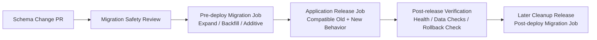

# Schema Change Deployment Procedure

[//]: # (owner: Project Maintainers)
[//]: # (review_cadence: Quarterly)
[//]: # (last_reviewed: 2026-04-11)

## Purpose

This procedure models how schema changes must be sequenced relative to application rollout.
It exists to make migration timing explicit and reviewable, even though the repository does not yet automate production database deployment itself.

The required operating model is:

- migrations run as a separate controlled job
- safe schema expansion is separated from application cutover
- destructive cleanup is separated again into a later release

## Why Ordering Matters

Application binaries are easy to roll back.
Database schema changes are not.

If ordering is wrong:

- old code can fail immediately after deployment because required columns or tables disappeared
- rollback can fail because the previous version expects an earlier schema shape
- mixed-version windows can corrupt data when old and new code write incompatible formats

Therefore the repository treats schema timing as part of release integrity, not as a local implementation detail.

## Controlled Deployment Phases

### Pre-deploy migration job

Purpose:

- apply additive schema changes
- create compatibility structures
- run backfills that must exist before new application reads depend on them

Allowed examples:

- add nullable columns
- add new tables or indexes
- create compatibility views
- backfill data while old and new application versions remain safe

### Application release job

Purpose:

- deploy the application version that can operate against both the old and expanded schema shape
- switch reads or writes gradually when the release plan requires cutover behavior

Requirements:

- old version remains safe immediately after pre-deploy expand migrations
- new version remains safe before cleanup has run
- rollback remains possible without emergency schema repair

### Post-deploy migration job

Purpose:

- run cleanup only after the new application behavior is live and the old path is retired

Allowed examples:

- enforce stricter constraints after backfill completion
- remove compatibility triggers or views
- drop deprecated columns or tables in a later cleanup release

This phase must not run in the same release as the initial replacement path.

## Release Sequencing Diagram

## Compatible Release Procedure

Use this procedure for normal expand-and-contract changes:

1. Merge a PR that introduces additive schema changes and compatible application behavior.
2. Run the pre-deploy migration job first.
3. Verify the migration completed successfully and the schema state matches the expected expand phase.
4. Deploy the application release.
5. Verify health, read/write behavior, and rollback safety.
6. Schedule cleanup only in a later release once the old path is no longer required.

Expected testability:

- migration files are reviewable under `app/server/src/infra/db/migrations/`
- `npm run test:db` exercises fresh bootstrap and incremental upgrade behavior
- `npm run db:migrate:status` shows the current migration state

## Breaking or Destructive Release Procedure

The repository does not permit same-release destructive schema replacement in normal delivery.

If a change is truly exceptional:

1. record the exception in the PR using the migration exception fields
2. identify the outage or maintenance assumption explicitly
3. separate pre-deploy preparation from the destructive action
4. document rollback and recovery before merge
5. treat the release as a governed exception, not a standard schema change

Examples that require this path:

- stop-the-world table reshape
- immediate column rename without compatibility bridge
- same-release drop of a live field used by the previous application version

## Deployment Procedure for Schema Changes

Use this checklist when executing a governed schema release:

1. Confirm whether the release is expand, cutover, or cleanup.
2. Confirm the migration files and PR metadata match that phase.
3. Run the pre-deploy migration job before application rollout when schema expansion or backfill is required.
4. Deploy only an application version that is compatible with the post-migration schema.
5. Verify health checks, smoke tests, and any schema-specific data checks.
6. Delay destructive cleanup until a later release after compatibility evidence exists.

## Relationship to Current Repository Workflows

The current repository models this sequencing even though the release workflow does not yet invoke database jobs directly:

- migration safety is reviewed in PR validation
- migration strategy defines what may run before or after app deployment
- DB-backed tests prove fresh bootstrap and incremental upgrade behavior

This keeps rollout order explicit and testable without pretending the current GitHub workflow is already orchestrating production database execution.
