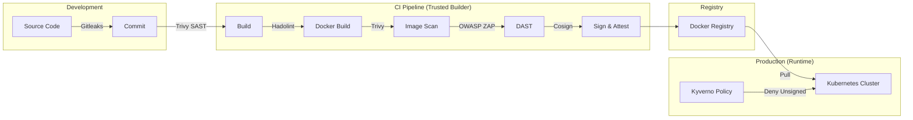

# Security Controls

## 1. Summary

This document outlines the threat landscape for the **Governed Software Delivery Pipeline**. It identifies potential attack vectors against the **software supply chain** and details the specific engineering controls implemented to mitigate them.

The security model assumes a "Zero Trust" approach to the build pipeline:
- We do not trust the Code (scanned for secrets/bugs).
- We do not trust the Dependencies (scanned for CVEs).
- We do not trust the Artifact (must be signed).
- We do not trust the Runtime (must verify signatures).

---

## 2. Assets at Risk

- **Source Code:** Intellectual property and business logic.
- **Build Environment:** The CI/CD runners that compile the application.
- **Container Artifacts:** The final deployable units.
- **Signing Identity:** The OIDC identity used to sign releases.
- **Production Environment:** The Kubernetes cluster where the app runs.

---

## 3. Threat Analysis (STRIDE)

### A. Tampering (Integrity)

*Definition: Malicious modification of code, dependencies, or artifacts.*

| Threat Scenario | Attack Vector | Mitigation Control | Implementation Details |
| :--- | :--- | :--- | :--- |
| **Dependency Confusion / Poisoning** | Attacker injects a malicious package (e.g., `event-stream` attack) or a dependency introduces a Critical CVE. | **SCA (Software Composition Analysis)** | **Snyk** scans `package.json` and lockfiles during CI. Builds fail on High/Critical CVEs. |
| **Code Injection** | A developer unknowingly commits vulnerable code (XSS, Injection) or logic flaws. | **SAST & Unit Testing** | **Snyk Code** analyzes static source. **Jest** ensures logic acts as expected. |
| **Artifact Modification** | An attacker gains access to Docker Hub and pushes a malicious image overwriting `v1.0.0`. | **Immutable Digests & Signing** | The pipeline deploys by **SHA Digest**, not mutable tags. **Cosign** signs the image, effectively "freezing" the content. |
| **Dockerfile Tampering** | A developer changes the base image to an insecure version or runs as root. | **Infrastructure Linting** | **Hadolint** enforces Docker best practices (e.g., pinning versions, avoiding root). |

### B. Spoofing & Repudiation (Identity)

*Definition: Pretending to be a valid publisher or denying that an action took place.*

| Threat Scenario | Attack Vector | Mitigation Control | Implementation Details |
| :--- | :--- | :--- | :--- |
| **Rogue Container Deployment** | An attacker creates a valid-looking container and tries to deploy it to the cluster. | **Admission Control & Signature Verification** | **Kyverno** policy blocks any pod that does not contain a valid **Cosign** signature linked to this specific GitHub Repository. |
| **Stolen Signing Keys** | An attacker steals a private GPG key to sign malicious malware. | **Keyless Signing (OIDC)** | We use **Sigstore/Cosign Keyless**. There are no long-lived private keys to steal. Signing is bound to the ephemeral OIDC identity of the GitHub Action runner. |
| **Provenance Forgery** | An attacker claims a binary was built by the "Official Pipeline" when it was built on a laptop. | **SLSA Provenance** | **GitHub Attestations** generate unforgeable provenance linking the artifact to the exact Git Commit and Workflow Run ID. |

### C. Information Disclosure (Confidentiality)

*Definition: Leaking sensitive data.*

| Threat Scenario | Attack Vector | Mitigation Control | Implementation Details |
| :--- | :--- | :--- | :--- |
| **Hardcoded Secrets** | A developer accidentally commits AWS keys or API tokens to Git. | **Secret Scanning** | **Gitleaks** scans the commit history before the build proceeds. |
| **Vulnerable Runtime Configuration** | The application leaks stack traces or lacks security headers in production. | **DAST (Dynamic Analysis)** | **OWASP ZAP** scans the running container for missing headers (`HSTS`, `X-Content-Type`) and information leakage. |

---

## 4. Defense Against Specific Attacks

### Scenario 1: The "Compromised Registry" Attack

**The Attack:** A hacker obtains the CI/CD credentials (DOCKER_TOKEN) and pushes a malware-laden image to `agslima/software-delivery-pipeline:latest`.
**The Defense:**

1.  **Kyverno** in the cluster sees the new image.
2.  It attempts to verify the signature using the **Cosign** public key transparency log.
3.  The hacker *could* push the image, but they **cannot** generate a valid signature because they do not have the GitHub Actions OIDC token.
4.  **Result:** The cluster **rejects** the deployment.

### Scenario 2: The "SolarWinds" Build Injection

**The Attack:** An attacker modifies the build environment itself to inject code *during* compilation, bypassing source code review.
**The Defense:**
1.  **Ephemeral Runners:** Each build runs on a fresh GitHub-hosted VM, destroying any persistence.
2.  **SLSA Provenance:** The `attest-build-provenance` step records exactly *where* and *how* the binary was built.
3.  **Verification:** A consumer (or the cluster) verifies the SLSA predicate. If the provenance claims the builder was "My-Laptop" instead of "GitHub-Actions," the artifact is rejected.

---

## 5. Residual Risks (Accepted Debt)

*The following risks are acknowledged and managed:*

1.  **Zero-Day Vulnerabilities:** Scanners (Snyk/Trivy) can only detect *known* CVEs. A true Zero-Day exploits a vulnerability before it is public.
    * *Mitigation:* **Syft SBOM** allows for rapid identification of affected components when a Zero-Day is announced.
2.  **GitHub Actions Compromise:** If GitHub itself is compromised, the OIDC trust chain could be broken.
    * *Mitigation:* This is a platform risk accepted by using a SaaS CI provider.

---

## 6. Security Architecture Diagram



---


# Security Threat Model (STRIDE)

## 1. Summary
This document outlines the threat landscape for the Governed Software Delivery Pipeline. It identifies potential attack vectors against the software supply chain and details the specific engineering controls implemented to mitigate them.
The security model assumes a "Zero Trust" approach to the build pipeline:
 * Trust No Code: Source is scanned for secrets and logic flaws.
 * Trust No Dependency: External libraries are scanned for CVEs.
 * Trust No Artifact: Binaries must be cryptographically signed.
 * Trust No Runtime: The cluster rejects any workload without verified provenance.

## 2. Assets at Risk
 * Source Code: Intellectual property and business logic.
 * Pipeline Configuration: The CI/CD definitions (.github/workflows) that enforce governance.
 * Signing Identity: The OIDC identity provided by GitHub Actions.
 * Production Cluster: The Kubernetes environment hosting the workload.

## 3. Threat Analysis (STRIDE)
We utilize the STRIDE model to categorize threats against the supply chain.
S - Spoofing (Identity)
Definition: Pretending to be a valid publisher.
| Threat Scenario | Attack Vector | Mitigation Control | Implementation |
|---|---|---|---|
| Rogue Container | Attacker pushes a malicious container to the registry. | Admission Control | Kyverno (k8s/policies/cluster) blocks images lacking a valid signature from this specific repo. |
| Key Theft | Attacker steals a private signing key. | Keyless Signing | Sigstore/Cosign uses ephemeral OIDC tokens. There are no static private keys to steal. |
T - Tampering (Integrity)
Definition: Malicious modification of data or artifacts.
| Threat Scenario | Attack Vector | Mitigation Control | Implementation |
|---|---|---|---|
| Dependency Confusion | Attacker injects a malicious package (e.g., event-stream). | SCA | Trivy scans package-lock.json during the build. |
| Artifact Mutation | Attacker overwrites v1.0 with a malicious image. | Immutable Digests | The pipeline deploys by SHA256 digest (image@sha256:...), not mutable tags. |
R - Repudiation (Logging)
Definition: Denying that an action took place.
| Threat Scenario | Attack Vector | Mitigation Control | Implementation |
|---|---|---|---|
| Provenance Forgery | Attacker claims a binary was built by CI, but built it locally. | SLSA Provenance | GitHub Attestations generate unforgeable proof linking the artifact to the specific run_id and commit_sha. |
I - Information Disclosure (Confidentiality)
Definition: Leaking sensitive data.
| Threat Scenario | Attack Vector | Mitigation Control | Implementation |
|---|---|---|---|
| Secret Leakage | Committing API keys to Git. | Secret Scanning | Gitleaks runs in the pipeline to detect high-entropy strings. |
| Runtime Leakage | App leaks stack traces/headers. | DAST | OWASP ZAP scans the running container for missing security headers. |
D - Denial of Service (Availability)
Definition: Reducing the ability of the system to serve valid requests.
| Threat Scenario | Attack Vector | Mitigation Control | Implementation |
|---|---|---|---|
| Resource Exhaustion | A container consumes all node CPU/RAM. | Resource Quotas | Kubernetes LimitRanges and Pod definitions enforce hard CPU/Memory limits. |
| Pipeline Abuse | Malicious PRs mining crypto on runners. | Approval Gates | GitHub "Require approval for outside collaborators" setting is enabled. |
E - Elevation of Privilege (Authorization)
Definition: Gaining capabilities beyond those initially granted.
| Threat Scenario | Attack Vector | Mitigation Control | Implementation |
|---|---|---|---|
| Container Escape | Process breaks out of container to Host OS. | Pod Security | Hadolint & Kyverno enforce "Run as Non-Root" and block privileged: true containers. |
| Policy Bypass | Attacker modifies the CI YAML to skip security scans. | Branch Protection | Main branch is protected. Changes to workflows require Code Owner review. |

## 4. Defense Against Specific Attacks
Scenario 1: The "Compromised Registry" Attack
The Attack: A hacker steals DOCKER_TOKEN and overwrites latest with malware.
The Defense:
 * Kyverno intercepts the deployment request.
 * It checks the image against the Cosign Transparency Log.
 * Result: Verification fails because the hacker's image was not signed by the specific OIDC identity of this GitHub Actions workflow. The cluster rejects the update.
Scenario 2: The "SolarWinds" Build Injection
The Attack: An attacker compromises the build server to inject code during compilation, bypassing source review.
The Defense:
 * Ephemeral Runners: Each build uses a fresh VM, preventing persistent malware.
 * SLSA Provenance: The build generates a signed "birth certificate" (Provenance).
 * Verification: We can cryptographically prove exactly which workflow run produced the binary. If the provenance data (Builder ID) doesn't match "GitHub Actions," the artifact is suspect.

## 5. Residual Risks (Accepted Debt)

 * Zero-Day Vulnerabilities: Scanners only find known issues.
   * Mitigation: Syft SBOM allows us to query our entire fleet for a specific package version instantly when a new CVE is disclosed (Response Speed vs. Prevention).
 * GitHub Account Compromise: If the maintainer's GitHub account is compromised, Branch Protection rules can be disabled.
   * Mitigation: MFA and Hardware Keys (YubiKey) are required for all maintainers.

## 6. Security Architecture Diagram

```bash
flowchart TD
    subgraph Trusted Zone [Trusted Build Zone]
        Code[Source Code] -->|Gitleaks| SAST[Trivy Code]
        SAST --> Build[Docker Build]
        Build -->|Hadolint| Lint[Linting]
        Lint -->|Cosign| Sign[Sign & Attest]
        Sign --> Provenance[SLSA Provenance]
    end

    subgraph Untrusted Zone [External/Runtime]
        Registry[Docker Registry]
        Cluster[Kubernetes Cluster]
    end

    Provenance --> Registry
    Sign --> Registry
    
    Registry -->|Pull Request| Cluster
    
    subgraph Governance [Policy Engine]
        Policy[Kyverno Admission Controller]
    end
    
    Policy -- "Verify Signature & Provenance" --> Cluster
    Policy -- "Block Unsigned" --> Cluster
```
