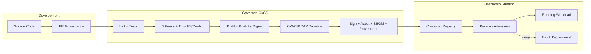

# Security Controls

## Governance Metadata

- **Last validated (release cadence):** 2026-03-11

## 1. Summary

This document outlines the threat landscape for the **Governed Software Delivery Pipeline**.
It focuses on software supply-chain risks and the controls implemented in this repository.

The security model follows a zero-trust posture for delivery:

- We do not trust source changes by default (PR checks + review gates).
- We do not trust code, dependencies, or infrastructure config by default (Gitleaks + Trivy scanning with workflow gates).
- We do not trust artifacts by default (keyless signatures + attestations).
- We do not trust runtime admission by default (Kyverno verification).

---

## 2. Assets at Risk

- **Source code and workflow definitions** (`app/`, `.github/workflows/`)
- **Build environment** (GitHub Actions runners)
- **Container artifacts** (images and digests)
- **Signing identity** (GitHub OIDC identity used by Cosign)
- **Runtime environment** (Kubernetes cluster admission boundary)

---

## 3. Threat Analysis (STRIDE)

### A. Tampering (Integrity)

| Threat Scenario | Attack Vector | Mitigation Control | Implementation Details |
| :--- | :--- | :--- | :--- |
| Dependency poisoning / vulnerable transitive packages | Malicious package or critical CVE in dependencies/base image | Trivy image/filesystem scanning with release gating | Trivy runs in PR checks (`fs` vuln + config), daily deep scan (`vuln,secret,config` outputs), and release image gate by digest; release blocks on `CRITICAL > 0` or `HIGH > 5` per image. |
| Code-level security defects | Vulnerable logic introduced by code change | PR quality gates and DAST in release/weekly workflows | Lint/tests run on PRs; OWASP ZAP baseline scans run in release gate and weekly DAST workflows for dynamic validation. |
| Artifact mutation in registry | Malicious image pushed to mutable tag | Immutable digests + signing + attestation checks | Deployment uses digest-pinned images; Cosign keyless signatures and attestations are verified before promotion/admission. |
| Dockerfile/manifest hardening regressions | Insecure Dockerfile or weak manifest config | Hadolint + Conftest + Kubeconform | PR validation blocks non-compliant Dockerfiles/manifests before merge. |

### B. Spoofing / Repudiation (Identity)

| Threat Scenario | Attack Vector | Mitigation Control | Implementation Details |
| :--- | :--- | :--- | :--- |
| Rogue container deployment | Untrusted image attempts cluster admission | Kyverno signature and attestation verification | Cluster policies require trusted issuer + release-workflow identity and required attestations. |
| Signing-key theft model | Long-lived private key compromise | Keyless signing (OIDC) | Cosign keyless uses short-lived certificates bound to GitHub OIDC identity. |
| Provenance forgery | Local build falsely claimed as CI build | Build provenance attestation | Release workflow emits provenance that is verifiable against trusted workflow identity. |

### C. Information Disclosure (Confidentiality)

| Threat Scenario | Attack Vector | Mitigation Control | Implementation Details |
| :--- | :--- | :--- | :--- |
| Hardcoded secrets in code/history | Token/credential committed to repository | Gitleaks + Trivy secret/config scanning | Gitleaks runs in PR and daily security workflows; Trivy scans filesystem, dependencies, secrets, and infrastructure config in PR/daily workflows. |
| Runtime information leakage | Missing headers / endpoint misconfig | OWASP ZAP DAST | Release and weekly DAST scans detect exposed attack surface and missing protections. |

---

## 4. Defense Against Specific Attacks

### Scenario 1: Compromised Registry Push

**Attack:** An attacker pushes a malicious image to the registry.

**Defense:**

1. Admission policy verifies signature identity and required attestations.
2. Attacker cannot satisfy trusted OIDC workflow identity for valid signature/attestation chain.
3. **Result:** Deployment is rejected.

### Scenario 2: Build Environment Injection

**Attack:** Malicious modification during build execution.

**Defense:**

1. Builds run on ephemeral GitHub-hosted runners.
2. Build provenance ties artifact to workflow/run/commit.
3. Verification catches provenance mismatch from untrusted build context.

---

## 5. Residual Risks (Accepted)

- **Zero-day vulnerabilities:** Gitleaks/Trivy/ZAP detect known patterns and behaviors only.
  - Mitigation: SBOM and provenance support faster impact triage and incident response.
- **CI platform compromise:** Trust chain depends on GitHub and OIDC integrity.
  - Mitigation: repository governance controls + admission checks + auditable break-glass process.
- **Scanner availability/outages:** Security tools may fail operationally.
  - Mitigation: fail-closed release gate + documented degraded-mode and break-glass ADRs.

---

## 6. Security Architecture Diagram

```mermaid
flowchart LR
    subgraph Development
        Code[Source Code] --> PR[PR Governance]
    end

    subgraph CI[Governed CI/CD]
        PR --> Q[Lint + Tests]
        Q --> S1[Gitleaks + Trivy FS/Config]
        S1 --> Build[Build + Push by Digest]
        Build --> DAST[OWASP ZAP Baseline]
        DAST --> SA[Sign + Attest + SBOM + Provenance]
    end

    SA --> Reg[Container Registry]

    subgraph Runtime[Kubernetes Runtime]
        Reg --> Adm[Kyverno Admission]
        Adm --> Workload[Running Workload]
        Adm -. deny .-> Block[Block Deployment]
    end
```
