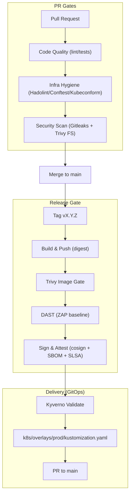

# Governed Software Delivery Pipeline (Full-Stack Reference Implementation)

## A Production-Grade CI/CD, Supply Chain & Governance Reference

[](https://github.com/agslima/software-delivery-pipeline/actions/workflows/ci-pr-validation.yml)
[](https://github.com/agslima/software-delivery-pipeline/actions/workflows/ci-release-gate.yml)
[](https://sonarcloud.io/summary/new_code?id=agslima_software-delivery-pipeline)
[](https://sonarcloud.io/summary/new_code?id=agslima_software-delivery-pipeline)
[](https://sonarcloud.io/summary/new_code?id=agslima_software-delivery-pipeline)
[](https://github.com/agslima/software-delivery-pipeline/attestations)
[](https://github.com/agslima/software-delivery-pipeline/tree/main/k8s)
[](https://github.com/aquasecurity/trivy)
[](https://www.zaproxy.org/)
[](https://www.apache.org/licenses/LICENSE-2.0.html)
<!--[](https://github.com/agslima/software-delivery-pipeline/actions/workflows/github-code-scanning/codeql)
[](https://github.com/agslima/software-delivery-pipeline/releases/latest)--> 

## TL;DR

This repository demonstrates how to design a **governed software delivery system** where:

- CI/CD acts as the **primary control plane**
- Security checks produce **verifiable attestations**, not just logs
- Container images are **signed, attested, and policy-enforced at runtime**
- Governance **cannot be bypassed**, even by developers with write access

> [!NOTE]
> The application logic is intentionally simple. The value of this repository lies in the **delivery architecture, security controls, and governance model**. For more details about the application, please see the **[`app/README.md`](https://github.com/agslima/software-delivery-pipeline/tree/main/app)**.

## Project Overview 🛡️

While modern projects routinely use tools like Trivy, ZAP, and GitHub Actions, this repository tries to answer a different question: **How do we prevent those controls from being silently bypassed?**

Instead of focusing on tools alone or treating security as a checkbox, this project serves as a reference implementation for **Governance-as-Code**, demonstrating how to:

- Enforce **security and quality guarantees structurally**
- Treat CI/CD as **part of the system architecture**
- Move from “we ran scans” → “**we can prove policy compliance**”

This is a full-stack reference implementation of a governed delivery pipeline, designed to showcase:

- DevOps & Platform Engineering practices
- Software supply-chain design
- Risk-based security decision-making
- Policy-as-Code enforced across CI and runtime

The application exists only to **exercise the pipeline**.

---

## Engineering Goals

The architecture was designed to satisfy three core **non-functional requirements**:

### 1. Reliability

- Builds are deterministic
- If code, tests, or policies fail, **no artifact is created**
- Release jobs are tag-gated and fail-fast

### 2. Traceability

Every container image is:

- Built from a specific Git commit
- Signed using keyless Sigstore (OIDC-bound identity)
- Attested with:
  - Build provenance (SLSA Level 3)
  - SBOM (SPDX)
  - Vulnerability and DAST results

### 3. Risk Management (Not Binary Security)

Security is treated as **policy-driven**, not “pass/fail everywhere”:

- **Blockers:** Critical & High vulnerabilities
- **Managed Debt:** Medium & Low vulnerabilities tracked explicitly
- Risk acceptance is versioned and auditable (`docs/security-debt.md`)

---

## Delivery Architecture (CI/CD as a Control Plane)

GitHub Actions is used intentionally as the **delivery control plane**.

### Why GitHub Actions?

- Pipeline logic is versioned with the code
- Branch protection and CODEOWNERS enforce governance before CI runs
- No external CI trust boundary
- Clear audit trail from commit → artifact → deployment

### Pipeline Flow



> This pipeline is intentionally **fail-fast**: artifacts are never built or published unless all required quality gates pass.

For more details on how branch protection, code ownership, and release integrity are enforced, see `docs/governance.md`.

---

## Quality & Risk Controls

### Layer 1: Pre-Build (Shift Left)

- **Unit Tests (TDD)**
- **Gitleaks:** Secret detection
- **Trivy (FS):** Vulnerability and secret scan on PRs; nightly deep scans include config/code in `ci-security-deep.yml`

### Layer 2: Artifact Construction

- **Docker Buildx** (digest-identified builds in the release gate)
- **Hadolint + OPA (Conftest) + Kubeconform:** Dockerfile hardening and K8s manifest validation in PRs
- **OWASP ZAP**
  - Release gate runs baseline scans against digest-pinned compose
  - Weekly workflow runs authenticated full scans and uploads SARIF
  - ZAP results are captured as artifacts; release gate attests results

### Layer 3: Supply Chain Guarantees (SLSA Level 3)
  
- **Cosign (Keyless):** OIDC-bound image signing
- **SLSA Provenance:** Verifiable build identity and process
- **Syft:** SPDX-formatted SBOM for transparency and future incident response
- **Typed Attestations:** Cryptographic proof that scans (Trivy/ZAP) actually occurred.

### Layer 4: Delivery (GitOps)

- **Kyverno:** Validates the updated manifests against cluster policies before opening a PR.
  
---

## Governance & Policy Enforcement

### GitOps Enforcement

- The pipeline utilizes a **Push-based GitOps** model.
- CI updates Kubernetes manifests with the **immutable image digest** of the newly signed artifact.
- A Pull Request is automatically opened to `main` with updated digests.
- **Constraint:** CI cannot commit to main directly; it must pass the same policy checks as a human developer.

### Runtime Admission Control

**Kubernetes** acts as the final gatekeeper using **Kyverno**. The cluster enforces:

- ​**Signature Verification:** Is this image signed by our repo?
- **​Attestation Checks:** Does this image have a SLSA provenance?
- **​Identity Validation:** Was this image built by the trusted CI workflow?

**Result:** If a developer tries to deploy an unsigned image (even manually), the cluster rejects it.

### Break-Glass (Emergency Access)

- Explicit security.break-glass=true label
- RBAC-restricted to on-call security role
- Mandatory justification labels
- Fully auditable

---

## Operational Evidence

### Case Study: Legacy Risk Remediation 🔬

To validate the effectiveness of the delivery control plane, a legacy application with known security debt was intentionally passed through the pipeline.

### Remediation Workflow

- **Baseline:**
  - Initial scans detected 27 Critical vulnerabilities

- **Triage:**
  - Dependency upgrades automated via Dependabot
  - Manual refactoring to mitigate XSS and Prototype Pollution

- **Risk Acceptance Policy:**
  - Zero Tolerance: Critical / High vulnerabilities block the pipeline
  - Accepted Risk: Medium / Low vulnerabilities may proceed if no patch exists, prioritizing delivery velocity

### Metrics & Results

| Severity | Initial Count | Current Count | Status |
| :--- | :---: | :---: | :--- |
| **Critical** | 27 | 0 | ✅ Fixed |
| **High** | 116 | 0 | ✅ Fixed |
| **Medium** | 191 | 0 | ✅ Fixed |
| **Low** | 345 | 2 | ℹ️ Managed Debt |

> This demonstrates risk-based decision making, not absolute zero-tolerance — a more realistic production posture.
> Managed debt is tracked in `docs/security-debt.md`, demonstrating risk-based decision making

### Evidence

Screenshots below are from a legacy remediation exercise; current workflows use Trivy for scanning.

| Initial Vulnerability Scan | Post-Fix Clean Scan |
| --- | --- |
|  |  |

---

## Verification (How to Audit)

You don't have to trust this documentation. You can cryptographically verify the artifacts yourself.

**Prerequisite:** Install [Cosign](https://docs.sigstore.dev/system_config/installation/)

### 1. Verify the Signature

Check that the image was signed by this specific GitHub Repository's CI pipeline using Keyless OIDC.

```bash
# 1. Export a release image digest (backend or frontend)
export IMAGE="docker.io/agslima/app-stayheathy-backend@sha256:<digest>"

# 2. Verify the signature against the OpenID Connect (OIDC) identity
cosign verify "$IMAGE" \
  --certificate-identity-regexp "^https://github.com/agslima/software-delivery-pipeline/.github/workflows/ci-release-gate\\.yml@refs/tags/v.*" \
  --certificate-oidc-issuer "https://token.actions.githubusercontent.com" | jq .
```

## Local Development & Testing

### Prerequisites

- **Node.js v18+**
- **Docker**

```bash
git clone https://github.com/agslima/software-delivery-pipeline.git
cd software-delivery-pipeline
npm install
npm test
npm start
```

---

## Technology Stack (Reference)

- **CI/CD:** GitHub Actions
- **Supply Chain:** Cosign, Syft (SBOM), GitHub build provenance (SLSA)
- **Security Analysis:** Trivy, OWASP ZAP, Gitleaks
- **Governance:** Kyverno
- **Containers:** Docker
- **Frontend/Backend:** React /Node.js
  
---

## What This Repository Demonstrates

- ✅ CI/CD as governance, not automation
- ✅ Security controls that cannot be silently bypassed
- ✅ Policy-driven risk management
- ✅ Supply-chain guarantees enforced at runtime
- ✅ Platform-grade GitOps flow

## What This Repository Is Not

- ❌ A framework comparison
- ❌ A zero-vulnerability application

---

## Role Alignment

- **DevOps Engineers:** CI/CD design, GitOps workflows, release governance
- **Platform Engineers:** Policy enforcement, admission control, supply-chain trust

---

## License

This project is licensed under the Apache 2 License. See the `LICENSE` file for details.

---

## Final Note

> This repository should be read as a **software delivery system**, not an application demo.
> The application exists to validate the **policies, controls, and engineering decisions** enforced by the pipeline.
