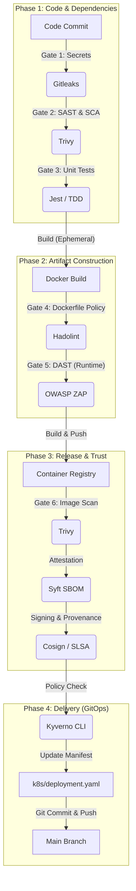
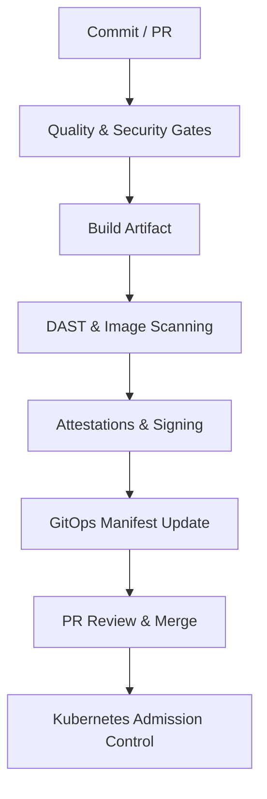

# Governed Software Delivery Pipeline (Full-Stack Reference Implementation)

[](https://github.com/agslima/secure-app-analysis/actions/workflows/ci-cd.yml)
[](https://github.com/agslima/software-delivery-pipeline/attestations)
[](https://github.com/agslima/software-delivery-pipeline/tree/main/k8s)
[](https://snyk.io/)
[](https://github.com/aquasecurity/trivy)
[](https://www.zaproxy.org/)
[](https://opensource.org/licenses/Apache-2.0)

### A Production-Grade CI/CD, Supply Chain & Governance Reference

> Mission: Design and implement a secure software delivery pipeline that balances strong security guarantees with development velocity, using CI/CD as the primary governance control plane.

## TL;DR

While modern projects routinely use tools like Trivy, ZAP, and GitHub Actions, this repository tries to answer a different question:**How we prevent those controls from being silently bypassed?**

Instead of focusing on tools alone or treating security as a checkbox,this project serves as a reference implementation for **Governance-as-Code**, demonstrating how to:

- Enforce **security and quality guarantees structurally**
- Treat CI/CD as **part of the system architecture**
- Move from “we ran scans” → “**we can prove policy compliance**”


This repository demonstrates how to design a **governed software delivery system** where:

- CI/CD acts as the **primary control plane**
- Security checks produce **verifiable attestations**, not just logs
- Container images are **signed, attested, and policy-enforced at runtime**
- Governance **cannot be bypassed**, even by developers with write access

> The application is intentionally simple.
>The value is in the delivery architecture, security controls, and governance model.

## Project Overview 🛡️

This is a full-stack reference implementation of a governed delivery pipeline, designed to showcase:
- DevOps & Platform Engineering practices
- Software supply-chain design
- Risk-based security decision-making
- Policy-as-Code enforced across CI and runtime

This project also demonstrates the design and operation of a governed software delivery pipeline, focusing on:

Rather than emphasizing a specific programming language or framework, the application serves as a delivery vehicle to showcase:

- Policy-driven CI/CD (GitHub Actions as the control plane)
- Defense in Depth across build, artifact, and runtime phases
- Zero Trust supply-chain controls using keyless signing
- Managed security debt in a real-world delivery scenario

The result is a **production-oriented reference implementation** of how modern teams enforce engineering standards across the SDLC.

--- 

## Engineering Goals

The architecture was designed to satisfy three core **non-functional requirements**:

### 1. Reliability

- Builds are deterministic
- If code, tests, or policies fail, **no artifact is created**
- Release jobs are tag-gated and fail-fast

### 2. Traceability

Every container image is:
- Built from a specific Git commit
- Signed using keyless Sigstore (OIDC-bound identity)
- Attested with:
  - Build provenance (SLSA Level 3)
  - SBOM (SPDX)
  - Vulnerability and DAST results

### 3. Risk Management (Not Binary Security)

Security is treated as **policy-driven**, not “pass/fail everywhere”:

- **Blockers:** Critical & High vulnerabilities
- **Managed Debt:** Medium & Low vulnerabilities tracked explicitly
- Risk acceptance is versioned and auditable (`docs/security-debt.md`)

---

## Delivery Architecture (CI/CD as a Control Plane)

### CI/CD as a Control Plane

GitHub Actions is used intentionally as the **delivery control plane**.

#### Why GitHub Actions?

- Pipeline logic is versioned with the code
- Branch protection and CODEOWNERS enforce governance before CI runs
- No external CI trust boundary
- Clear audit trail from commit → artifact → deployment

### Delivery Architecture


```mermaid

graph TD
    subgraph "Phase 1: Code & Dependencies"
        A[Code Commit] -->|Gate 1: Secrets| B(Gitleaks)
        B -->|Gate 2: SAST & SCA| C(Trivy)
        C -->|Gate 3: Unit Tests| D(Jest / TDD)
    end
    
    subgraph "Phase 2: Artifact Construction"
        D -->|"Build (Ephemeral)"| E[Docker Build]
        E -->|Gate 4: Dockerfile Policy| F(Hadolint)
        F -->|"Gate 5: DAST (Runtime)"| G(OWASP ZAP)
    end
    
    subgraph "Phase 3: Release & Trust"
        G -->|Build & Push| H[Container Registry]
        H -->|Gate 6: Image Scan| I(Trivy)
        I -->|Attestation| J(Syft SBOM)
        J -->|Signing & Provenance| K(Cosign / SLSA)
    end

    subgraph "Phase 4: Delivery (GitOps)"
        K -->|Policy Check| L(Kyverno CLI)
        L -->|Update Manifest| M[k8s/deployment.yaml]
        M -->|Git Commit & Push| N[Main Branch]
    end
```

> This pipeline is intentionally **fail-fast**: artifacts are never built or published unless all required quality gates pass.

For more details on how is enforce branch protection, code ownership, and release integrity, see `docs/GOVERNANCE.md`.

---


```mermaid
flowchart TD
    A[Commit / PR] --> B[Quality & Security Gates]
    B --> C[Build Artifact]
    C --> D[DAST & Image Scanning]
    D --> E[Attestations & Signing]
    E --> F[GitOps Manifest Update]
    F --> G[PR Review & Merge]
    G --> H[Kubernetes Admission Control]
```

## Quality & Risk Controls

### Layer 1: Pre-Build (Shift Left)

- **Unit Tests (TDD)**
- **Gitleaks:** Secret detection
- **Snyk (SAST/SCA):** Analyzes source code and dependency trees
- **Trivy (FS / IaC)**:
  - Dependency vulnerabilities
  - Kubernetes misconfigurations

### Layer 2: Artifact Construction

- **Docker Buildx** (reproducible builds)
- **Hadolint + OPA (Conftest):** Dockerfile hardening (non-root users, pinned versions), and Policy drift detection
- **OWASP ZAP**
  - Pipeline spins up an ephemeral application instance
  - Actively scans runtime behavior (headers, cookies, misconfigurations)
  - Debug-friendly failure handling (container logs preserved)
  - ZAP results are captured and attested, not used as raw CI output
 
  ### Layer 3: Supply Chain Guarantees (SLSA Level 3)
  
- **Cosign (Keyless):** OIDC-bound image signing
- **SLSA Provenance:** Verifiable build identity and process
- **Syft:** SPDX-formatted SBOM for transparency and future incident response
- **Typed Attestations:**
  - Trivy vulnerability summary
  - ZAP DAST results
 
  ### Layer 4: Delivery (GitOps)

- **Kyverno:** Policy Check
  
---

## Governance & Policy Enforcement

### GitOps Enforcement

Deployment requires a Pull Request
- The pipeline does not deploy directly.
- CI updates Kubernetes manifests with **immutable image digests**
- Kyverno policies enforce that only images signed by this workflow identity can run
- Changes are pushed to a GitOps branch

### Runtime Admission Control

Kubernetes enforces:

- Image signature verification
- Required attestations (Trivy + ZAP)
- Provenance identity checks
- All enforced using Kyverno.

> If a scan step is removed from CI, deployment still fails.

<!--
### Break-Glass (Emergency Access)

- Explicit security.break-glass=true label
- RBAC-restricted to on-call security role
- Mandatory justification labels
- Fully auditable
-->

---

## Operational Evidence

### Case Study: Legacy Risk Remediation 🔬

To validate the effectiveness of the delivery control plane, a legacy application with known security debt was intentionally passed through the pipeline.

### Remediation Workflow

- **Baseline:**
  - Initial scans detected 27 Critical vulnerabilities

- **Triage:**
  - Dependency upgrades automated via Snyk
  - Manual refactoring to mitigate XSS and Prototype Pollution

- **Risk Acceptance Policy:**
  - Zero Tolerance: Critical / High vulnerabilities block the pipeline
  - Accepted Risk: Medium / Low vulnerabilities may proceed if no patch exists, prioritizing delivery velocity

### Metrics & Results

| Severity | Initial Count | Current Count | Status |
| :--- | :---: | :---: | :--- |
| **Critical** | 27 | 0 | ✅ Fixed |
| **High** | 116 | 0 | ✅ Fixed |
| **Medium** | 191 | 0 | ✅ Fixed (29/12/2025) |
| **Low** | 345 | 2 | ℹ️ Managed Debt |

> This demonstrates risk-based decision making, not absolute zero-tolerance — a more realistic production posture.
> Managed debt is tracked in `docs/security-debt.md`, demonstrating risk-based decision making

### Evidence

| Initial Vulnerability Scan | Post-Fix Clean Scan |
| --- | --- |
|  |  |

---

## Local Development & Testing

### Prerequisites

- **Node.js v18+**
- **Docker**

```bash
git clone https://github.com/agslima/software-delivery-pipeline.git
cd software-delivery-pipeline
npm install
npm test
npm start
```

---

## Technology Stack (Reference)

- **CI/CD:** GitHub Actions
- **Supply Chain:** Cosign, Syft, SLSA Generator
- **Security Analysis:** Trivy, OWASP ZAP, Gitleaks
- **Governance:** Kyverno
- **Containers:** Docker
- **Frontend/Backend:** React /Node.js

> The application stack is intentionally simple — the focus is on delivery architecture, not framework complexity.

---

## What This Repository Demonstrates

- ✅ CI/CD as governance, not automation
- ✅ Security controls that cannot be silently bypassed
- ✅ Policy-driven risk management
- ✅ Supply-chain guarantees enforced at runtime
- ✅ Platform-grade GitOps flow

## What This Repository Is Not

- ❌ A framework comparison
- ❌ A zero-vulnerability application

---

## License

This project is licensed under the Apache 2 License. See the `LICENSE` file for details.

---

## Final Note

> This repository should be read as a **software delivery system**, not an application demo.
> The application exists to validate the **policies, controls, and engineering decisions** enforced by the pipeline.
