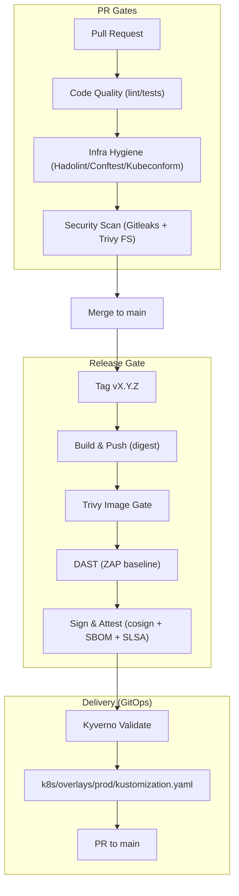

# Governed Software Delivery Pipeline

[//]: # (owner: Project Maintainers)
[//]: # (review_cadence: Quarterly)
[//]: # (last_reviewed: 2026-03-11)
[//]: # (Controls matrix: docs/governance.md#readme-claims--controls-matrix)

## A Reference Implementation for CI/CD Governance, Supply Chain Security, and Runtime Policy Enforcement

[](https://github.com/agslima/software-delivery-pipeline/actions/workflows/ci-pr-validation.yml)
[](https://github.com/agslima/software-delivery-pipeline/actions/workflows/ci-release-gate.yml)
[](https://sonarcloud.io/summary/new_code?id=agslima_software-delivery-pipeline)
[](https://sonarcloud.io/summary/new_code?id=agslima_software-delivery-pipeline)
[](https://github.com/agslima/software-delivery-pipeline/tree/main/k8s)
[](https://github.com/agslima/software-delivery-pipeline/attestations)
[](https://www.apache.org/licenses/LICENSE-2.0.html)

## TL;DR

This repository demonstrates a **governed software delivery system** in which:

- CI/CD is treated as part of the **system’s control plane**
- Security checks produce **verifiable evidence**, not only workflow logs
- Container images are **signed, attested, and validated** through policy before deployment
- The delivery path is designed to make governance bypass **difficult, visible, and auditable**

## Problem Statement 🛡️

While modern projects routinely use tools like Trivy, ZAP, and GitHub Actions, this repository tries to answer a different question: **How do we prevent those controls from being silently bypassed?**

Rather than treating security as a checklist or tooling as the end goal, this repository models **governance as a system property**. It shows how CI/CD, signing, attestations, policy checks, and runtime admission controls can work together to produce **auditable delivery evidence**, not just successful workflow runs.

This is a full-stack reference implementation of a governed delivery pipeline, designed to showcase:

- Governed CI/CD design
- Software supply-chain integrity controls
- Risk-based policy enforcement
- Runtime admission validation tied to build identity

> [!NOTE]
> The application logic is intentionally simple. The value of this repository lies in the **delivery architecture, security controls, and governance model**. For more details about the application, please see the **[`app/readme.md`](https://github.com/agslima/software-delivery-pipeline/blob/main/app/readme.md)**.

---

## Architectural Goals

The repository is organized around three core **non-functional goals**:

### 1. Reliability

- Builds are deterministic
- If code, tests, or policies fail, **no artifact is signed, trusted, or promoted**
- Release jobs are tag-gated and fail-fast

### 2. Traceability

Each released container image is tied to a specific Git commit and accompanied by verifiable supply-chain metadata:
- Keyless Sigstore signature bound to CI identity
- Build provenance
- SBOM (SPDX)
- Attested security evidence from vulnerability and DAST workflows

### 3. Risk Management (Not Binary Security)

Security is treated as **policy-driven**, not “pass/fail everywhere”:

- **Blockers:** Critical vulnerabilities and High vulnerabilities above policy threshold (`HIGH > 5` per image in the release gate)
- **Managed Debt:** Medium & Low vulnerabilities tracked explicitly
- Risk acceptance is versioned and auditable (`docs/security-debt.md`)

---

## Delivery Architecture (CI/CD as a Control Plane)

In this repository, CI/CD is treated as part of the **delivery control plane** rather than as passive automation.

### Why GitHub Actions?

- Pipeline logic is versioned alongside the application and policy code
- Repository controls such as branch protection and CODEOWNERS are part of the governance model
- Delivery logic remains repository-native and auditable
- Clear audit trail from commit → artifact → deployment

### Pipeline Flow

At a high level, the repository separates governance into three stages: PR validation, release integrity, and delivery enforcement.


```mermaid
graph TD
    subgraph "PR Gates"
        A[Pull Request] --> B["Code Quality (lint/tests)"]
        B --> C["Infra Hygiene (Hadolint/Conftest/Kubeconform)"]
        C --> D["Security Scan (Gitleaks + Trivy FS)"]
    end

    D --> E[Merge to main]
    E --> F[Tag vX.Y.Z]

    subgraph "Release Gate"
        F --> G["Build & Push (digest)"]
        G --> H[Trivy Image Gate]
        H --> I["DAST (ZAP baseline)"]
        I --> J["Sign & Attest (cosign + SBOM + SLSA)"]
    end

    subgraph "Delivery (GitOps)"
        J --> K[Kyverno Validate]
        K --> L[k8s/overlays/prod/kustomization.yaml]
        L --> M[PR to main]
    end
```

> This pipeline is intentionally **fail-fast**: artifacts may be built and pushed before later release gates complete, but they are not signed, trusted, or promoted unless all required quality gates pass.

For more details on how branch protection, code ownership, and release integrity are enforced, see [`docs/governance.md`](docs/governance.md).

---

## Quality & Risk Controls

### Layer 1: Pre-Build (Shift Left)

- **Unit Tests (TDD)**
- **Gitleaks:** Secret detection
- **Trivy (FS):** Vulnerability and secret scan on PRs; nightly deep scans include config/code in `ci-security-deep.yml`

### Layer 2: Artifact Construction

- **Docker Buildx:** digest-identified builds in the release gate
- **Hadolint + OPA (Conftest) + Kubeconform:** Dockerfile and Kubernetes manifest validation during PR
- **OWASP ZAP**: baseline scans in the release path; authenticated scheduled scans for deeper coverage
  
### Layer 3: Supply Chain Guarantees (SLSA Level 2)
  
- **Cosign (Keyless):** OIDC-bound image signing
- **SLSA Provenance:** Verifiable build identity and process
- **Syft:** SPDX-formatted SBOM for transparency and future incident response
- **Security attestations:** signed evidence that required scans were executed

### Layer 4: Delivery (GitOps)

- **Kyverno:** validates deployment manifests against cluster policy expectations before the digest update is proposed for merge

---

## Governance & Policy Enforcement

### GitOps Enforcement

- The pipeline utilizes a **Push-based GitOps** model.
- CI updates Kubernetes manifests with the **immutable image digest** of the newly signed artifact.
- A Pull Request is automatically opened to `main` with updated digests.
- **Constraint:** CI cannot commit to main directly; it pass the same policy checks as a human developer.

### Runtime Admission Control

At deployment time, **Kyverno** enforces runtime admission checks inside the cluster.

- ​**Signature Verification:** Is this image signed by our repo?
- **​Attestation Checks:** Does this image have a SLSA provenance?
- **​Identity Validation:** Was this image built by the trusted CI workflow?

**Result:** If a developer tries to deploy an unsigned image (even manually), the cluster rejects it.

### Break-Glass (Emergency Access)

- Requires a `security.break-glass=true` label
- Restricted by RBAC
- Mandatory justification labels
- Fully auditable

---

## Operational Evidence

This section summarizes the repository’s current published security posture and links to the underlying evidence.

<!-- [BEGIN_GENERATED_TABLE] -->
### Automated Security Posture

| Severity | Initial Count | Current Count | Status |
| :--- | :---: | :---: | :--- |
| **Critical** | 27 | 0 | ✅ Fixed |
| **High** | 116 | 1 | ❌ Must fix |
| **Medium** | 191 | 2 | ℹ️ Managed Debt |
| **Low** | 345 | 2 | ℹ️ Managed Debt |

*Last scanned (UTC): 2026-03-09 18:10*
<!-- [END_GENERATED_TABLE] -->

This table is **automatically generated** by the repository evidence pipeline and reflects the current published security snapshot tracked under [`docs/snyk/`](docs/snyk/index.md).

It is governance evidence, not the release admission gate itself. Snyk snapshots document published posture over time, but they do not decide whether a release can proceed.

Release blocking remains driven by the Trivy and ZAP controls described above and enforced in:
- [`docs/threat-model.md`](docs/threat-model.md)
- [`.github/workflows/ci-release-gate.yml`](.github/workflows/ci-release-gate.yml) (`trivy-scan`, `dast-analysis`, `sign-and-attest`)
- [`docs/governance.md`](docs/governance.md#readme-claims--controls-matrix)

“Baseline / Initial Count” refers to the intentionally vulnerable starting state used to validate remediation and policy behavior. “Current” reflects the latest published scan snapshot.

Interpretation:
- **Critical:** release-blocking.
- **High:** release-blocking when the release gate threshold is exceeded (`HIGH > 5` per image).
- **Medium / Low:** allowed only when tracked as time-bound managed debt in [`docs/security-debt.md`](docs/security-debt.md).
- **Managed Debt:** displayed when Medium or Low vulnerabilities remain open under approved governance controls.

### Case Study 🔬

To validate that the governance model works in practice, the application described in [app/readme.md](app/readme.md) was intentionally exercised through the pipeline with known vulnerabilities and security weaknesses. The goal was not to showcase an insecure app, but to demonstrate how the delivery system detects, blocks, tracks, and verifies remediation.

### Remediation Workflow

- **Baseline:** initial scans surfaced known dependency and application risks
- **Triage:** Dependabot automated dependency upgrades; manual changes mitigated issues such as XSS and Prototype Pollution.
- **Governance outcome:** Critical findings block release, and High findings block release when they exceed the documented threshold (`HIGH > 5` per image). Medium and Low findings may proceed only under documented, time-bound exception governance.

### Evidence

| Initial Vulnerability Scan |
| --- |
|  |

Reviewer traceability:
- Posture evidence source: [`docs/snyk/index.md`](docs/snyk/index.md)
- Release gate enforcement source: [`.github/workflows/ci-release-gate.yml`](.github/workflows/ci-release-gate.yml)
- Runtime/admission control rationale: [`docs/threat-model.md`](docs/threat-model.md)

---

## Verification (How to Audit)

You do not need to rely on README claims alone. The release artifacts can be independently verified.

**Prerequisite:** Install [Cosign](https://docs.sigstore.dev/system_config/installation/)

### 1. Verify the Signature

Check that the image was signed by this specific GitHub Repository's CI pipeline using Keyless OIDC.

```bash
# 1. Export a release image digest (backend or frontend)
export IMAGE="docker.io/agslima/app-stayhealthy-backend@sha256:<digest>"

# 2. Verify the signature against the OpenID Connect (OIDC) identity
cosign verify "$IMAGE" \
  --certificate-identity-regexp "^https://github.com/agslima/software-delivery-pipeline/.github/workflows/ci-release-gate\\.yml@refs/tags/v.*" \
  --certificate-oidc-issuer "https://token.actions.githubusercontent.com" | jq .
```

## Local Development & Testing

Use the root README for the command map, and use [`app/readme.md`](app/readme.md#quickstart-local-development) for the application-specific environment setup, database bootstrap, and local runtime prerequisites.

### Prerequisites

- **Node.js 24.13.0** (required by `app/server` and `app/client`)
- **npm**
- **Docker / Docker Compose** for the local PostgreSQL dependency described in [`app/readme.md`](app/readme.md#quickstart-local-development)

### Onboarding Flow

1. Initialize local application secrets and `.env` by following [`app/readme.md`](app/readme.md#1-initialize-env-and-local-secrets).
2. Start the local PostgreSQL dependency by following [`app/readme.md`](app/readme.md#2-start-local-postgres-only).
3. Run the package-level commands below from the repository root.

### Install Dependencies

```bash
npm --prefix app/server install
npm --prefix app/client install
```

### Lint

```bash
npm --prefix app/server run lint
npm --prefix app/client run lint
```

### Test

```bash
npm --prefix app/server run test
npm --prefix app/client run test
```

### Start

Start commands assume the environment export and database steps from [`app/readme.md`](app/readme.md#4-export-runtime-env-for-local-server-process) and [`app/readme.md`](app/readme.md#6-migrate-and-seed-database) are already complete.

```bash
npm --prefix app/server run dev
npm --prefix app/client run dev
```

The backend package lives in `app/server`; the frontend package lives in `app/client`. The application README remains the detailed source for local credentials, migrations, seed data, and verification URLs.

---

## Technology Stack

- **CI/CD:** GitHub Actions
- **Supply Chain:** Cosign, Syft (SBOM), GitHub build provenance (SLSA)
- **Security Analysis:** Trivy, Snyk, OWASP ZAP, Gitleaks
- **Policy enforcement:** Kyverno
- **Runtime platform:** Docker, Kubernetes 
- **Application:** React /Node.js
  
---

## What This Repository Demonstrates

- ✅ CI/CD treated as governance, not just automation
- ✅ Security controls designed to be difficult to bypass silently
- ✅ Policy-driven risk management
- ✅ Supply-chain guarantees enforced at runtime
- ✅ A governed GitOps-style delivery path

## What This Repository Is Not

- ❌ A framework comparison
- ❌ A zero-vulnerability application
- ❌ Immune to privileged administrative bypass outside the modeled trust boundaries
---

## Role Alignment

- **DevOps Engineers:** CI/CD design, GitOps workflows, release governance
- **Platform Engineers:** Policy enforcement, admission control, supply-chain trust

---

## License

This project is licensed under the Apache 2 License. See the `LICENSE` file for details.

---

## Final Note

> This repository should be read as a **software delivery system**, not an application demo.
> The application exists to validate the **policies, controls, and engineering decisions** enforced by the pipeline.
